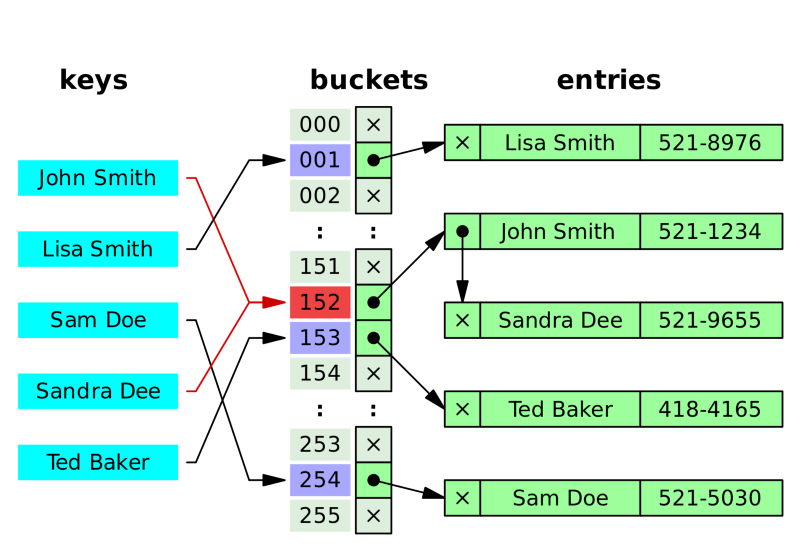
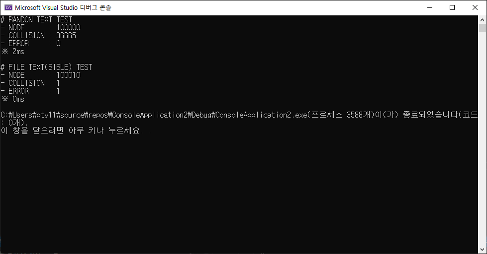

# Effective Hashing
1. [sysnet : 괜찮은 문자열 해쉬함수?](https://www.sysnet.pe.kr/2/0/1222)
2. [rucaus : String Hash 함수에 대해](http://egloos.zum.com/rucaus/v/2348565)
3. [circlee7 : String 과 hash , 31](https://medium.com/@circlee7/string-%EA%B0%9D%EC%B2%B4%EC%97%90-%EB%8C%80%ED%95%9C-%ED%95%B4%EC%8B%9C-%ED%95%A8%EC%88%98-8dab5fdaafe6)
4. [Naver D2 : Java HashMap은 어떻게 동작하는가?](https://d2.naver.com/helloworld/831311)
5. [partow : General Purpose Hash Function Algorithms](http://www.partow.net/programming/hashfunctions/#HashingMethodologies)
6. [wiki : 분할상환분석](https://ko.wikipedia.org/wiki/%EB%B6%84%ED%95%A0%EC%83%81%ED%99%98%EB%B6%84%EC%84%9D)
7. [cyranocoding : 해시 해싱 해시테이블 자료구죠의 이해](https://velog.io/@cyranocoding/Hash-Hashing-Hash-Table%ED%95%B4%EC%8B%9C-%ED%95%B4%EC%8B%B1-%ED%95%B4%EC%8B%9C%ED%85%8C%EC%9D%B4%EB%B8%94-%EC%9E%90%EB%A3%8C%EA%B5%AC%EC%A1%B0%EC%9D%98-%EC%9D%B4%ED%95%B4-6ijyonph6o)
8. [ratsgo : 해싱, 해시함수, 해시테이블](https://ratsgo.github.io/data%20structure&algorithm/2017/10/25/hash/)
9. [igniter : LinkedHashMap 순서를 유지하는 해시맵](https://medium.com/@igniter.yoo/java-linkedhashmap-%EC%88%9C%EC%84%9C%EB%A5%BC-%EC%9C%A0%EC%A7%80%ED%95%98%EB%8A%94-%ED%95%B4%EC%8B%9C%EB%A7%B5-11a7846d8893)

  

## 다항식을 이용한 문자열 Hashing
- Rabin Fingerprint로 만들거다. 계수는 31, 밑은 2, 모듈러는 그때그때 적절히 큰 소수로. 곱셈연산 횟수를 줄이기 위해 호너 법칙을 이용한다.
- 응용프로그램에는 데이터셋에 따라 시프트 연산 등을 이용하여 충돌을 최소화한다.

  

## 계수는 31, 모듈러는 큰 소수인 이유는?
- [왜 소수로 모듈러 연산을 할까?](https://cs.stackexchange.com/questions/11029/why-is-it-best-to-use-a-prime-number-as-a-mod-in-a-hashing-function) 충돌을 피하기 위해. 피연산자와 공약수가 있으면, 해당 버킷으로만 분류된다. 소수는 1과 자기자신으로만 나눠질 수 있으므로, 그런 충돌이 발생할 확률이 적다. 처리하는 데이터의 양과 시스템을 고려하여 충분히 큰 소수를 택하면 충돌을 피할 수 있다.
  - 그런데 꼭 그런것만은 아니다. [데이터 셋에 따라 해시 충돌횟수가 많이 달라진다.](https://www.sysnet.pe.kr/2/0/1223) 소수로 나누기만 한다고 끝나는 것은 아니다.
  - [컴파일러 동작](https://gamedevforever.com/50)도 고려하면서 작성해야 한다. 31이 특정 환경에서는 왼쪽 시프트로 최적화될 수 있기 때문에 사용했듯, 문자열 비교때 해시 함수를 썼을 때 운용환경에서 어떤 효과가 있는지 면밀히 살펴야 하겠다.

- [왜 계수는 31인가?](https://stackoverflow.com/questions/299304/why-does-javas-hashcode-in-string-use-31-as-a-multiplier) 31이 소수이며 또한 어떤 수에 31을 곱하는 것은 빠르게 계산할 수 있기 때문이다. 31N = 32N-N인데, 32는 2의 5승이니 어떤 수에 32를 곱한 값은 shift연산으로 쉽게 구할 수 있다. 따라서 N에 31을 곱한 값은, (N<<5)-N과 같다. 31을 곱하는 연산은 이렇게 최적화된 머신 코드로 생성할 수 있기 때문에, 문자열 클래스에서 해시 값 계산할 때 31을 밑으로 사용한다. [- Effective Java에서](https://stackoverflow.com/questions/299304/why-does-javas-hashcode-in-string-use-31-as-a-multiplier) 
  
- 사실 별 이유 없다. SOV질답글 보면 자바 버그리포트가 있는데, 개발자가 31과 33모두 우수한 성능을 보였지만, 소수가 아니라는 이유로 33을 걸렀고 그 이후로 java에서 31을 해시함수 계수로 채택하고 있다. 귀납적인 성능테스트 결과 + 감..에 따른 것이므로, 이유를 찾는 것은 무의미하다. 되려 '머신코드로 돌렸을 때 최적화된 연산'을 찾았다는 점에 주목하자.
  
- 그래서 얻은 해시값은 잘 분산되어 있는가?라는 질문에, 가상난수 생성 알고리즘을 통해 답을 찾아보자.
  - '좋은' 가상난수의 조건은 1) 균등분포 2) 빠르게생성 3) 서로다른 난수를 많이 4) 생성된 난수를 순서대로 똑같이 재생성.. 으로 해시 알고리즘과 동일하다. '좋은' 가상난수 알고리즘이 있다면, 해싱 알고리즘의 구현에도 이용할 수 있을 [mip : 난수](http://mip.hnu.kr/courses/simulation/chap2/chap2.html)
  - 또한 난수 생성의 통계적 검정과정을 이용할 수도 있다. [mip : 난수의 통계적 검정](http://mip.hnu.kr/courses/simulation/chap2/chap2_2.html)

- 지수연산으로 발생하는 오버플로우 오류를 막을 방법은? 나머지연산을 이용한다. 이때 mod값은 큰 소수를 구해 사용하는 것이 효과적이다.

  > 오픈튜토리얼스 : 나머지의 법칙
  > (a+m)%m = a%m  
  > ((a%m) + (b%m))%m = (a+b)%mod  
  > ((a%m) * (b%m))%m = (a*b)%m  
  >
  > 


- 패턴 문자열 길이만큼 해시를 계산하면 단순비교와 다르지 않다. 계산량을 줄일 방법은 없을까? 가장 앞에 계산했던 값을 빼고, 마지막 계산값을 더한다. 구르듯 움직이는 롤링해시.
- 다항식 차수가 늘어날 때, 계산량을 줄일 방법은 없을까? [호너의 법칙](https://jackpot53.tistory.com/119)을 이용한다.
  - n차 다항식에서 단순 계산으로 답을 구하면 덧셈은 n번, 곱셈은 n(n+1)/2번 해야 한다.
  - k차항에서 구한 값을 k+1차항에서도 활용한다면, 곱셈을 2n번으로 줄일 수 있다.
  - 호너의 법칙은 k+1차항에서 k차항 이하를 아래와 같이 괄호로 묶어 계산하는 방식으로, 곱셈을 n번까지 울일 수 있다.
    
  
```java
//written by jackpot53, https://jackpot53.tistory.com/119

public class Polynomial {
 
    /**
     * @param  coefficients 는 다항식 각 차수의 계수이다.
     * @param x
     * */
    public static void computePolynomial(double[] coefficients, double x) {
 
        int totalAdditions = 0;
        int totalMultiplications = 0;
 
        int n = coefficients.length - 1;
        double result = coefficients[n];
 
        for (int i = n-1; i >= 0; i--) {
            result = (result * x) + coefficients[i];
            totalAdditions += 1;
            totalMultiplications += 1;
        }
 
        System.out.println(String.format("result=%.2f, " +
                "total addition = %d, " +
                "total multiplication = %d", result, totalAdditions, totalMultiplications));
    }
 
 
    public static void main(String[] args) {
        // Polynomial: 5x^4 + 2x^3 - 3x^2 + x - 7
        double[] examplePoly = new double[]{ -7, 1, -3, 2, 5 };
        Polynomial.computePolynomial(examplePoly, 3);
    }
 
}
```

  

## Hash충돌시 삽입/삭제/탐색

### Seperate Chaining

- 해시 충돌이 자주 발생하면 검색 효율이 낮아진다(쏠림)
- 외부 저장 공간을 사용해야하며, 이를 위한 추가 작업이 필요하다
- 시간복잡도 : 테이블 저장소 길이를 n 키의 수를 m이라고 했을 때 평균 1개 hash당 m/n개의 키가 들어있을 것이다. 이를 'a'라고 하자. 평균 a, 최악의 경우 n(한 해시에 모든 키가 몰려있을 때)의 시간복잡도를 가진다.

  

### Open Addressing

- 비어있는 해시에 데이터를 저장하는 방식인데, 이를 위해 다음 방식으로 해시값을 한번 더 구한다.
  - 선형탐색 : 다음 해시 +1나 n개를 건너뛰어 빈 해시에 저장
  - 제곱탐색 : 충돌 일어난 해시의 제곱에
  - 이중해시 : 다른 해시함수를 한번 더 적용
- 삽입, 삭제, 검색 모두 대상이 되는 Hash를 찾아가는 과정에 따라 시간복잡도가 계산이 된다. 해시함수를 통해 얻은 Hash가 비어있지 않으면 다음 버킷을 찾아가야 한다. 이 찾아가는 횟수가 많아지면 많아질 수록 시간복잡도가 증가한다. 최상의 경우 O(1) ~ 최악의 경우 (O(n)). 따라서 Open Addressing에서는 비어있는 공간을 확보하는 것(= 저장소가 어느 정도 채워졌을 때 저장소의 사이즈를 늘려주는 것)이 필요하다. 최악의 경우 저장소를 모두 살펴보아야 하는 경우가 생길 수 있다.(O(n))


### RANDOM/BIBLETEXT TEST



```c++
#include <iostream>
#include <fstream>
#include <time.h>
#define HASHTABLE_SIZE 100000
#define KEY_MAX_LENGTH 100
#define LINE_MAX_LENGTH 1000

using namespace std;

struct Node {
	char key[KEY_MAX_LENGTH];
	int value;
	Node* next = NULL;
};

class SolarHashTable {
private:
	Node* tb[HASHTABLE_SIZE];

public:
	int err = 0;
	int collision = 0;
	int nodeNum = 0;

public:
	void _init() {
		for (int i = 0; i < HASHTABLE_SIZE; i++) tb[i] = NULL;
		err = 0;
		collision = 0;
	}

	int _randTextTest() {
		srand(time(NULL));
		for (int i = 0; i < HASHTABLE_SIZE; i++) {
			char randKey[KEY_MAX_LENGTH];
			for (int k = 0; k < KEY_MAX_LENGTH - 1; k++) {
				randKey[k] = rand()%26 + 97; //ASCII
			}
			randKey[KEY_MAX_LENGTH - 1] = '\0';
			int randValue = rand()%100 + 1;
			addNode(randKey, randValue);
		}
		return 0;
	}

	int _fileTextTest() {
		ifstream fileReader;
		fileReader.open("bible.txt");
		if (fileReader.is_open()) {
			while (!fileReader.eof()) {
				if (nodeNum > HASHTABLE_SIZE) break;
				//istream style
				char buffer[LINE_MAX_LENGTH];
				fileReader.getline(buffer, LINE_MAX_LENGTH);
				//cout << "cursor : " << buffer << endl;
				
				//std style
				//string buffer;
				//getline(fileReader, buffer);
				int front = 0, rear = 0;
				while (buffer[rear] != '\0') {
					if (buffer[rear] == ' ') {
						char token[KEY_MAX_LENGTH];
						int i = 0;
						while (front < rear) {
							token[i] = buffer[front];
							i++, front++;
						}
						token[i] = '\0';
						int v = 0;
						addNode(token, v);
						rear++;
						front = rear;
					}
					else {
						rear++;
					}
				}

			}
		}
		return 0;
	}

	bool keyCmp(char(&o1)[KEY_MAX_LENGTH], char(&o2)[KEY_MAX_LENGTH]) {
		int i = 0;
		while (o1[i] != '\0' && o2[i] != '\0') {
			if (o1[i] != o2[i]) return false;
			i++;
		}
		if (i < sizeof(o1) / sizeof(int) || i < sizeof(o2) / sizeof(int)) return false;
		return true;
	}

	void keyCpy(char(&dist)[KEY_MAX_LENGTH], char(&src)[KEY_MAX_LENGTH], int length) {
		int i = 0;
		while (src[i] != '\0' && i < length) {
			dist[i] = src[i];
			i++;
		}
		dist[i] = '\0';
	}

	int addNode(char(&key)[KEY_MAX_LENGTH], int value) {
		nodeNum++;
		int pos = getHash(key);
		Node* cur;
		//cout << "#HASHCODE : " << pos << endl;

		if (tb[pos] != NULL) {
			if (keyCmp(tb[pos]->key, key)) {
				err++;
				//cout << "ERR(SAME KEYVALUE) : ";
				//for (int i = 0; key[i] != '\0'; i++) cout << key[i] << " ";
				//cout << endl;
				return -1;
			}
			else {
				collision++;
				//cout << "HASH COLLISION : ";
				//for (int i = 0; key[i] != '\0'; i++) cout << key[i] << " ";
				//cout << endl;
				cur = tb[pos];
				while (cur->next != NULL) {
					if (keyCmp(key, cur->key)) break;
					else cur = cur->next;
				}
				cur->next = new Node;
				keyCpy(cur->next->key, key, KEY_MAX_LENGTH - 1);
				cur->value = value;
				return 1;
			}
		}
		tb[pos] = new Node;
		keyCpy(tb[pos]->key, key, KEY_MAX_LENGTH - 1);
		tb[pos]->value = value;
		return 0;
	}

	int delNode(char(&key)[KEY_MAX_LENGTH]) {
		//TODO
	}

	int editNode(char (&key)[KEY_MAX_LENGTH], int value) {
		Node* n = getNode(key);
		n->value = value;
	}

	Node* getNode(char (&key)[KEY_MAX_LENGTH]) {
		int pos = getHash(key);
		Node* cur = tb[pos];
		while (cur->next != NULL) {
			if (keyCmp(key, cur->key)) break;
			else cur = cur->next;
		}
		return cur;
	}
	
	int getHash(char key[]);
};

int SolarHashTable::getHash(char key[]) {
	int hash = 0;
	int poly = 0xEDB88320;
	for (int i = 0; key[i] != '\0'; i++) {
		hash = (hash * 31 + key[i]); //rabin-carp
		//hash = (65599 * hash + key[i]); //x65599
		//poly = (poly << 1) | (poly >> (32 - 1)); hash = (int)(poly * hash + key[i]); //0xEDB88320 + 1bit Shift
	}
	hash %= HASHTABLE_SIZE;
	if (hash < 0) hash *= -1;
	return hash;
}

SolarHashTable st;
int main() {
	time_t start, end;
	double result;

	start = time(NULL);
	st._init();
	st._randTextTest();
	cout << "RANDON TEXT TEST" << endl;
	cout << "[NODE      : " << st.nodeNum << "]" << endl;
	cout << "[COLLISION : " << st.collision << "]" << endl;
	cout << "[ERROR     : " << st.err << "]" << endl;
	end = time(NULL);
	result = (double)(end - start);
	cout << "※ " << result << "ms" << endl;
	
	start = time(NULL);
	st._init();
	st._fileTextTest();
	cout << "FILE TEXT(BIBLE) TEST" << endl;
	cout << "[NODE      : " << st.nodeNum << "]" << endl;
	cout << "[COLLISION : " << st.collision << "]" << endl;
	cout << "[ERROR     : " << st.err << "]" << endl;
	end = time(NULL);
	result = (double)(end - start);
	cout << "※ " << result << "ms" << endl;

	return 0;
}
```


