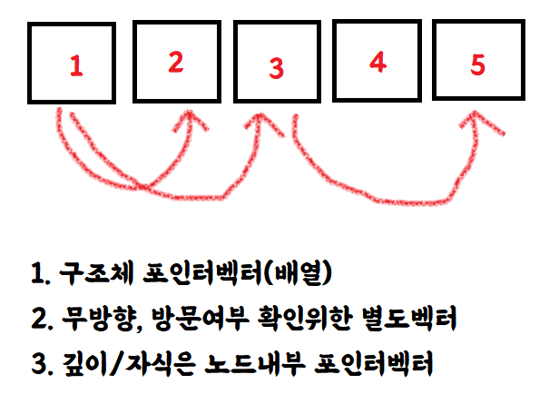

# Lowest Common Ancestor

- `O(logN)` : 세그먼트 트리 또는 다이나믹 사용
- `O(N)` : 두 정점이 만날 때까지 부모노드로 이동

```c++
#include<iostream>
#include<vector>
#define SWAP(a, b) {int t=a; a=b; b=t;}

/*
* - 두 노드가 서로만날때까지 위로 이동(전처리DFS)
* - 구간트리를 활용(이진트리)
* - 다이나믹을 사용(전처리DFS)
* from jason9319.tistory.com/90
*/

using namespace std;

struct BOJ11437 {
	int data;
	int depth;
	vector<BOJ11437*> adj;

	BOJ11437(int d) {
		data = d;
		depth = -1;
		adj = vector<BOJ11437*>();
	}
};

vector<BOJ11437*> nodelist; //index starts from 1
vector<vector<int>> parent; //2^15=32768, 2^16=65536
vector<int> visited;

void dfs(int no, int depth) {
	visited[no] = 1;
	nodelist[no]->depth = depth;

	for (int i = 0; i < nodelist[no]->adj.size(); i++) {
		int c = nodelist[no]->adj[i]->data;
		if (visited[c]) continue;
		parent[c][0] = no;
		dfs(c, depth + 1);
	}
}

void memoparent(int max) {
	for (int j = 1; j < 17; j++) {
		for (int i = 1; i < max; i++) {
			parent[i][j] = parent[parent[i][j - 1]][j - 1];
		}
	}
}

int lca(int a, int b) { //b>=a
    //더 깊은 쪽은 위로 끌어올린다, 2^i
	if (nodelist[a]->depth > nodelist[b]->depth) SWAP(a, b);
	for (int i = 17; i >= 0; i--) {
		if (nodelist[b]->depth - nodelist[a]->depth >= (1 << i)) b = parent[b][i];
	}
    //깊이가 같아지면 공통부모노드를 찾는다, 2^i
	if (a == b) {
		return a;
	}
	else for (int i = 16; i >= 0; i--) {
		if (parent[a][i] != parent[b][i]) {
			a = parent[a][i];
			b = parent[b][i];
		}
	}
	return parent[a][0];
}

int BOJ11437main() {
	int n; cin >> n; 
	{
		nodelist.resize(n + 1);
		parent.resize(n + 1);
		visited.resize(n + 1);
		for (int i = 0; i <= n; i++) {
			nodelist[i] = new BOJ11437(i);
			parent[i] = vector<int>(17);
		}
	}
	
	for (int i = 0; i < n - 1; i++) {
		int a, b; cin >> a >> b;
		nodelist[a]->adj.push_back(nodelist[b]);
		nodelist[b]->adj.push_back(nodelist[a]);
	}
	dfs(1, 0);
	memoparent(n + 1);

	int m; cin >> m;
	vector<int> answer;
	for (int tc = 0; tc < m; tc++) {
		int a, b; cin >> a >> b;
		answer.push_back(lca(a,R b));
	}
	for (int i = 0; i < answer.size(); i++) cout << answer[i] << endl;

	return 0;
}
```

REFERENCE : https://jason9319.tistory.com/90  

QUESTION : 순서를 지키지 않고 입력되는 간선으로 트리 구성하기

