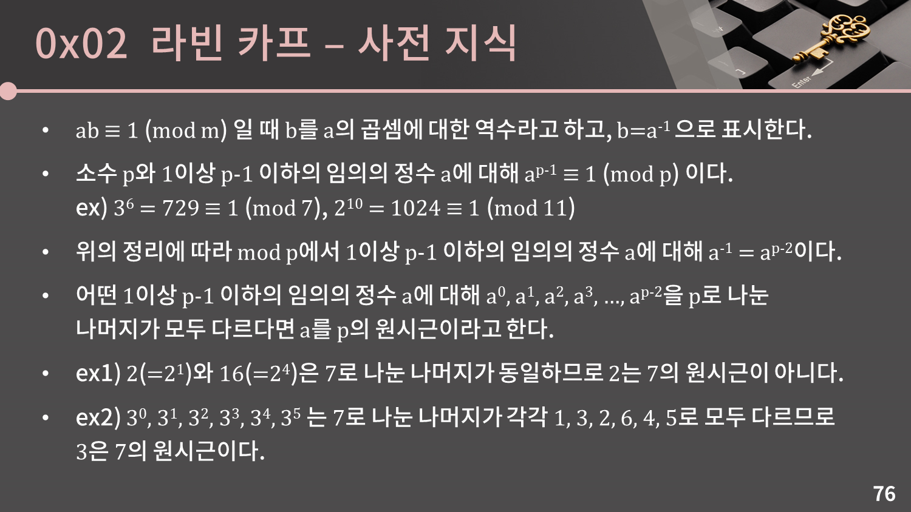
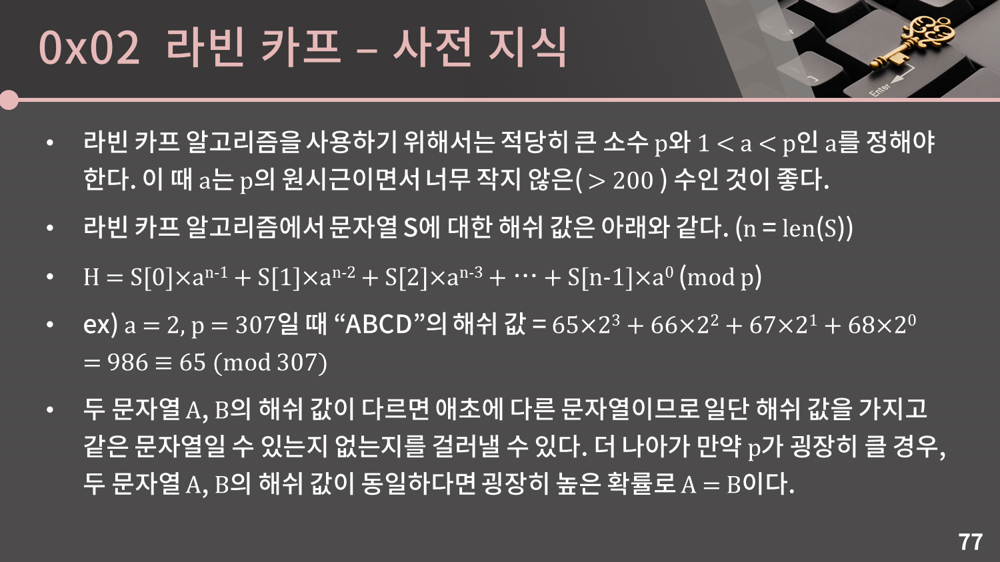
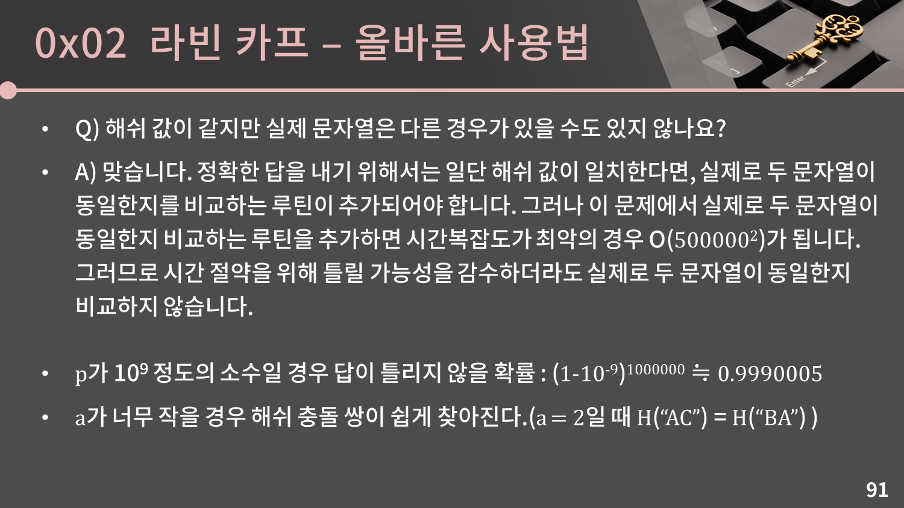
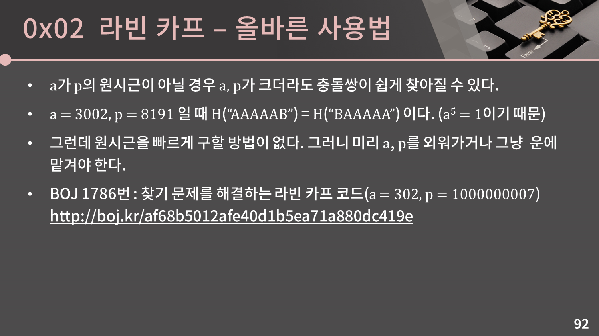

# Karp-Rabin Algorithms
길이가 t인 텍스트 T에서, 길이가 p인 텍스트 P패턴이 발생하는지 찾는 문제. 문자열 매칭에 관해 알아보겠다.
> [wiki : Rabin-Karp algorithm](https://en.wikipedia.org/wiki/Rabin%E2%80%93Karp_algorithm)  
> [wiki : Rabin fingerprint](https://en.wikipedia.org/wiki/Rabin_fingerprint)  






## Karp-Rabin(aka "Fingerprint" Method)
여기서 소개할 아이디어는 문자열 S에 대하여 다음 특성을 가지는 특별한 롤링해시 h(S) 구현하는 것이다.
1. 약간의 전처리를 거친 뒤에, 문자열 T[i...(i+p-1)]의 해시로부터 h(T[(i+1)...(i+p)])의 연산을 선형시간 내 마칠 수 있다(모든 연산은 임의의 소수의 나머지 연산으로 마친다  q=O(t\*p^2)
2. 해시테이블 충돌이 발생할 확률은 "낮다"

우선 충돌은 고려하지 않고, 이러한 해시 함수가 전통적인 탐색 문제를 어떻게 해결할 수 있는지 보자. 패턴에 대하여 h(P) 해시값을 구하고, 0,1...t-p 범위의 i값에 대하여 모든 T[i...(i+p-1)] 부분문자열에 대하여 해시값을 구한다. 둘이 일치하는 위치를 찾아 출력한다. 이 연산은 t-p+1번 수행되므로, O(t-p+1) 시간내 해결할 수 있다. 해싱에 O(p) 시간이 소요되니, 결론적으로 O(t+p) 시간이 소요된다.

{0, 1} 범위의 알파벳이 있다고 가정해 보자. 위와 같은 방식의 Karp-Rabin 해시값은 다음과 같다. 임의의 소수 q에 대하여 나머지 연산도 수행한다. 부분문자열내 (j-i+1)개의 비트자료를 확인하는 것이다. 이를 부분문자열의 "fingerprint"라 부른다.
```
Hq(T[i...j]) = (T[i]*2^(j-i) + T[i+1]*2^(j-i-1) + ... + T[j]*2^0) mod q
```

다음 위치의 해시값은 결론부터 말하자면, Hq[i+1] = [{Hq[i]-T[i]\*2^(j-i)}2 + T[j+1]\*2^0] mod q와 같이, 이전 값으로부터 굴러이동 하듯이 반복되는 연산을 생략하고 구할 수 있다.
```
Hq(T[i+1...j]+1) = (T[i+1]*2^(j-i) + T[i+2]*2^(j-i-1) + ... + T[j]*2^1 + T[j+1]*2^0) mod q
Hq(T[i+1...j]+1) = ((T[i+1]*2(j-i-1) + T[i+2]*2(j-i-2) +... + T[j]*2^0)2 + T[j+1]*2^0) mod q
Hq(T[i+1...j]+1) = ((Hq(T[i...j]) - T[i]*2^(j-i))*2 + T[j+1]*2^0) mod q
```
> [오픈튜토리얼스 : 나머지의 법칙](https://opentutorials.org/module/1544/9532)  
> (a+m)%m = a%m  
> ((a%m) + (b%m))%m = (a+b)%mod  
> ((a%m) \* (b%m))%m = (a\*b)%m  

### (??)Probability of False Positive
특정한 인덱스 i에 대하여 충돌할 확률을 d라고 하자. 가능한 위치는 모두 t-p+1개이므로, 충돌이 발생할 확률의 상한은 (t-p+1)d <= td 이라고 볼 수 있다. 확률을 1/2 이하로 맞추고자 한다면, d<=1/(2t)이 만족함을 보여야 한다.  
> [gem763 깃헙 : 확률의 이해](https://gem763.github.io/probability%20theory/%ED%99%95%EB%A5%A0%EC%9D%98-%EC%9D%B4%ED%95%B4.html), union bound는 합계상한이란 뜻이다.  

우리가 세운 식에서 임의로 정하는건 소수 q뿐이다. p비트의 부분문자열 T[i...(i+p-1)]이 대표하는 수(a라고 하자)와 역시 p비트의 부분문자열 P가 대표하는 수가 일치하지 않지만, 나머지 연산을 수행하면 같아질 때, 이것을 오류가 발생했다고 본다. q 나머지에 대하여 동치일 때(being equivalent modulo q), |a-b|는 q로 나누어 떨어진다는 말이기도 하다[역주: (a\*q + m) % q == (b\*q + m) % q이므로, (a\*q + m) - (b\*q + m) = (a-b)\*q이고 이는 q로 나누어 떨어진다.] 따라서, q는 이러한 수에 대하여 적어도 하나 이상의 "나쁜" 값을 가지게 된다. [역주: (t-p)의 소인수들 q에 대하여 오류가 발생할 수 있다]

We would like to claim that choosing a uniformly random prime number q in the range {2...K} the chance that we choose one of (at most) p bad values is smaller than 1=(2t). For this, it suffices to choose K large enough such that there are at least 2pt primes between 2 and K. For this we use the Prime Number theorem: if there are ㅠ(x) primes between 0 and x, then the theorem says that (소수정리) And while this is just an asymptotic statement, we also know that (this was proved by Chebyshev back in 1848). Now setting K to equal, say, 10pt ln pt ensures that ㅠ(K) >= 2pt for large enough pt, which proves the result.

오류를 줄이기 위해, 문자열 매칭과 소수 q고르는 일을 독립적으로 수행할 수도 있다. fingerprint가 일치할 때만 문자열 매치가 이뤄진다고 가정하고서. 또는 K를 증가시켜나갈 수도 있다.

### Picking a Random Prime
임의의 소수를 어떻게 고를 것인가.
- 0...M사이 임의의 정수 X를 고른다{난수표에서 문자열 길이에 상응하는 인덱스의 것을 고른다}
- X가 소수인지 확인하고, 맞다면 그렇게 입력하며, 그렇지 않다면 첫번째 단계로 돌아간다{소수인지 확인하기 : 얼마나 반복해야 할까? 소수이론을 확인하라.}
  - [wiki : miller-rabin primality test](https://en.wikipedia.org/wiki/Miller%E2%80%93Rabin_primality_test)
  - [wiki : AKS primality test](https://en.wikipedia.org/wiki/AKS_primality_test)
  
### Rolling hash, and fingerprint algorithm
라빈카프 알고리즘을 구현할 때 많이들 내부적으로 라빈 fingerprint를 사용하는데, 그런데....

> Because it shares the same author as the Rabin–Karp string search algorithm, which is often explained with another, simpler rolling hash, and because this simpler rolling hash is also a polynomial, both rolling hashes are often mistaken for each other. The backup software restic uses a Rabin fingerprint for splitting files, with blob size varying between 512 bytes and 8MiB  
> [rdd6584 백준 : 해시로 장난치기](https://www.acmicpc.net/blog/view/67)  
> [potatogim 위키 : Rsync 알고리즘](https://www.potatogim.net/wiki/Rsync_%EC%95%8C%EA%B3%A0%EB%A6%AC%EC%A6%98)
