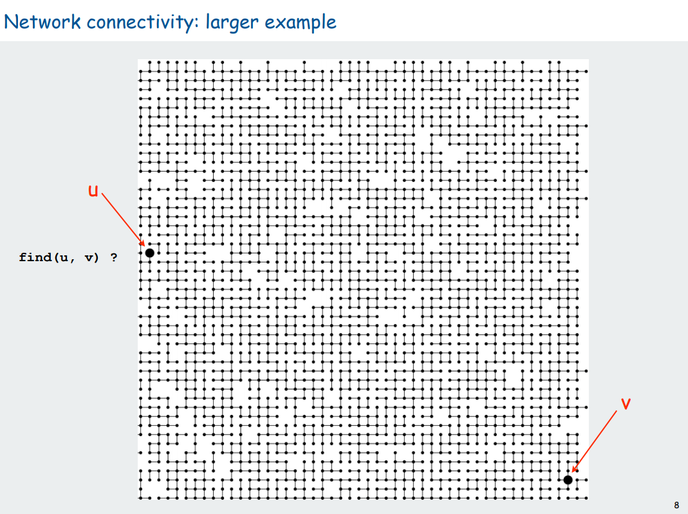
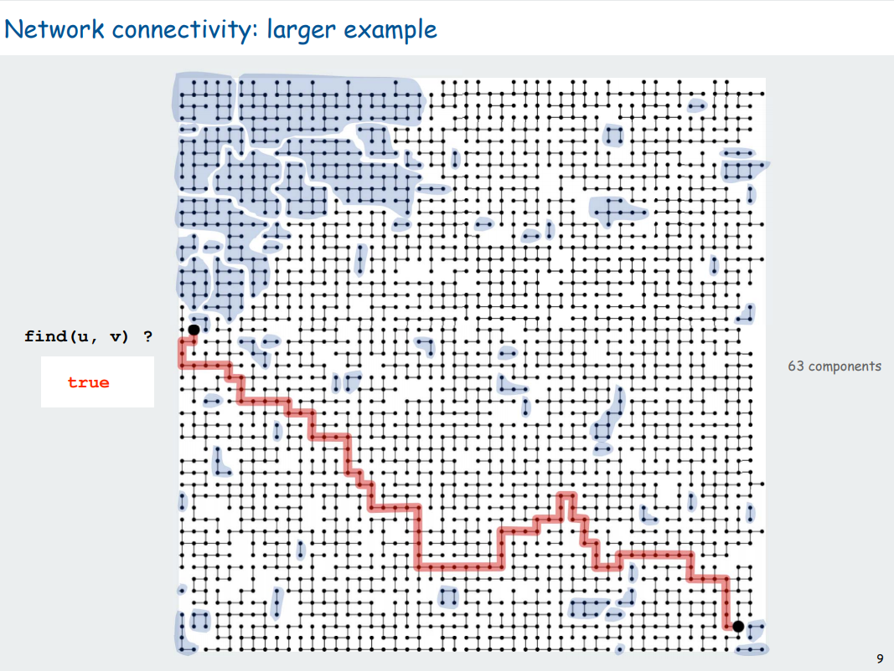

# graph(minimum-spanning-tree)

- **Kruskal**

  - 간선을 오름차순으로 정렬 `O(ElogE)`

  - 사이클이 생기지 않도록 간선을 선택 `O(1)*E`

  - 모든 정점을 방문할 때까지 반복

    ```
    O(ElogE + E)
    = O(ElogV^2)
    = O(2*ElogV)
    = O(ElogV)
    ```

    
    
    
  
- **Prim**
  - 임의의 간선을 선택
  - 선택한 간선으로부터 가중치가 낮은 순서대로 정점 선택 `O(ElogE)`
  - 모든 정점을 방문할 때까지 반복 `O(1)*E`
  


- **Union Find**

  - problem
    

  - solve
    

  - 구현방법 : 방문시 그룹 아이디/부모노드를 지정. 또는 루트노트를 지정. 비용절감을 위해 트리가 너무 깊어지지 않도록 조절해준다.

    ```c++
    #include <iostream>
    #include <vector>
    #include <algorithm>
    
    using namespace std;
    
    bool sortMethod(const vector<int>& v1, const vector<int>& v2) {
        return v1[2] < v2[2];
    }
    
    inline bool allVisited(vector<int> &v) {
        for (int i = 1; i < v.size(); i++) {
            if (v[i]==0 || v[i] != v[i - 1]) return false;
        }
        return true;
    }
    
    int solution(int n, vector<vector<int>> cost) {
        sort(cost.begin(), cost.end(), sortMethod);
        vector<int> visit(n);
        int pos = 0, answer = 0, gId = 1;
        while (!allVisited(visit) && pos < cost.size()) {
            if (visit[cost[pos][0]] || visit[cost[pos][1]]) {
                //avoid cycle
                if (visit[cost[pos][0]] == visit[cost[pos][1]]) {
                    //cout << pos << "는 거른다." << endl;
                    pos++;
                    continue;
                }
                //union group
                int t = visit[cost[pos][0]] > visit[cost[pos][1]] ? visit[cost[pos][0]] : visit[cost[pos][1]];
                if (visit[cost[pos][0]] == 0) visit[cost[pos][0]] = t;
                else if (visit[cost[pos][1]] == 0) visit[cost[pos][1]] = t;
                else {
                    vector<int> temp(n);
                    temp.assign(visit.begin(), visit.end());
                    for (int i = 0; i < visit.size(); i++) {
                        if (visit[i] == visit[cost[pos][0]] || visit[i] == visit[cost[pos][1]]) temp[i] = t;
                    }
                    visit.assign(temp.begin(), temp.end());
                }
            }
            else {
                //set group
                visit[cost[pos][0]] = gId;
                visit[cost[pos][1]] = gId;
                gId++;
            }
            answer += cost[pos][2];
            //cout << pos << "는 포함한다." << endl;
            pos++;
        }
    
        cout << answer << endl;;
        return answer;
    }
    ```


> **REFERENCE**
> [https://velog.io/@fldfls/최소-신장-트리-MST-크루스칼-프림-알고리즘](https://velog.io/@fldfls/최소-신장-트리-MST-크루스칼-프림-알고리즘)
> https://godls036.tistory.com/26
> https://www.cs.princeton.edu/~rs/AlgsDS07/01UnionFind.pdf