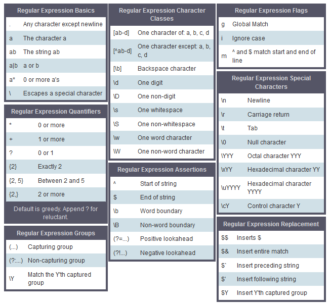

## [Printer Errors](https://www.codewars.com/kata/printer-errors/train/javascript)

* INPUT : `string(/[a-z]/+)`
* OUTPUT : `the length of the control string / the number of errors(/[n-z]/)`

```javascript
function printerError(s) {
    var comp = s.replace(/[n-z]+/gi, '');
    var denom = s.length;
    return (denom-comp.length) + "/" + (denom);
}
```
> match메서드 사용할걸, g플래그는 필수라해도 i는 굳이?

### [JS String Methods](https://developer.mozilla.org/ko/docs/Web/JavaScript/Reference/Global_Objects/String)
- 문자열 리터럴과 객체는 다르다. 그런데 JS는 자동으로 문자열 리터럴을 객체로 변환하고, 문자열 객체도 리터럴로 바꿔주는 메서드를 제공한다(..대체왜?)
- `eval()`로 전달하면, 문자열 리터럴은 소스코드로 취급된다. 그런데 문자열 객체도 valueOf()메서드로 문자열 리터럴로 바꿔줄 수 있다(..아까그거)
- String Generic 메서드 : JS1.6이며 ES표준은 아니다.
- String Instance
  - `.length`
  - `.charAt()` 등
- 문자열로 변환할 때 `.toString()`써도 되지만, `new String()`이 좀더 안전하다.

### [JS RegEx Pattern](https://developer.mozilla.org/ko/docs/Web/JavaScript/Reference/Global_Objects/RegExp)
```javascript
/pattern/flags               /*문자표기*/
new RegExp(pattern[, flags]) /*생성자로 만들때*/
```
- flags
  - g(global match, 일치하는 첫번째 문자에서 멈추지 않고 전체에서 일치하는 모든 문자를 검색)
  - i(ignore case, 대소문자를 구별하지 않음)
  - m(multiline, 시작/끝문자 패턴을 다중행에 적용함. 각각 라인의 시작 혹은 끝뿐 아니라 전체 라인의 시작 혹은 끝에도 적용)
  - y(sticky, `lastIndex` 프로퍼티가 가리키는 데 까지만 비교함. 예) abaaba문자열에서 메소드를 여러번 호출하면 `lastIndex`는 차례로 3,6이 된다)
- literal : 표현식이 평가될때 컴파일된 형태로 제공되며, 상수 형태로 변경되지 않을때 사용한다. 컴퓨터 자원도 절약할 수 있다.
- constructor : 표현식이 런타임에 컴파일됨(ES6부터는 정규식 생성자에 문자열이 아니라 정규식 리터럴을 입력해도 `[TypeError](https://developer.mozilla.org/ko/docs/Web/JavaScript/Reference/Global_Objects/TypeError)`가 뜨지 않는다.)
- [JavaScript Regex Cheatsheet](https://www.debuggex.com/cheatsheet/regex/javascript)


## [참고 : JS 비교연산자](https://developer.mozilla.org/ko/docs/Web/JavaScript/Reference/Operators/Comparison_Operators)
