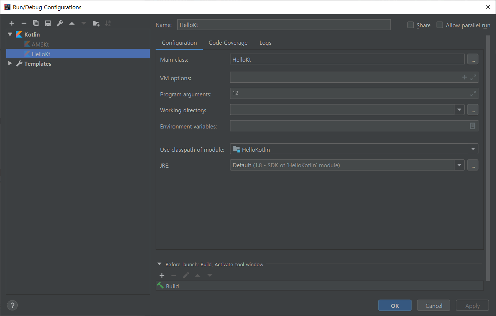

# Hello Kotlin at Android

- 함수형 언어
- 람다표현식
- 고계함수

## [Udecity Tutorial Course](https://classroom.udacity.com/courses/ud9011)

### Looping over arrays and lists
```kotlin
val numbers = arrayOf(11,12,13,14,15)
val tmpList = mutableListOf<String>()
for(i in numbers){
    tmpList.add(i.toString())
}
```
- Array생성하기
  - `arrayOf([element], ...)`
  - `arrayOfNulls([size :int])`
  - `Array([size]){[function returning intial value of each array element, arguments are its index]}`
```kotlin
// Creates an Array<String> with values ["0", "1", "4", "9", "16"]
val asc = Array(5) { i -> (i * i).toString() }
asc.forEach { println(it) }
```
- List생성하기 : 상동
- *for in loop* [생각보다 심오한 for loop의 세계](https://soulduse.tistory.com/71)
  - iterator
  - filter
  - range : `..`, `until`, `downTo`, `step`
- T : 제네릭타입
- Unit : java의 `void`에 대응, Unit은 단 하나의 인스턴스를 가지는 싱글톤객체.
- Nothing : "no value at all", 반환값 없는 함수에 쓸 수 있다. `Nothing` 표시 없으면 묵시적으로 `Unit`

### passing arguments through command-line
```kotlin
fun main(args: Array<String>) {
    val flag = args[0].toInt() //패키지 import해줘야함
    var msg = ""
    if(flag<12) msg = "good morning"
    else msg = "good night"
    println("$msg, kotlin")
}
```
- args[0] -> `java.lang.ArrayIndexOutOfBoundsException` : Run - Edit Configuration - Program argument

