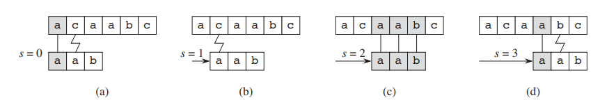
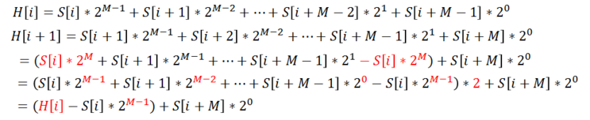

# String Match

## 단순비교
- 시간복잡도는 O((n-m+1)m), m=n/2인 경우 O(n^2)
- 의사코드는 아래와 같다. 대상문자열 T에서 P를 탐색할 때, 인덱스를 하나씩 늘려가며 비교하는 방식이다.
```
NAIVE-STRING-MATCHER(T,P)
n = T.length
m = P.length
for s = 0 to n-m
    if P[1..m] == T[s+1..s+m]
	    "s 시프트에 의한 패턴"을 출력한다.
```



- JAVA로 구현하면 아래와 같다.
```java
    public static void naiveSearch(String Text, String Pattern) {
        System.out.println("NAIVE-SEARCH");
        MStack m = new MStack(Text.length());
        for (int begin = 0; begin + Pattern.length() <= Text.length(); ++begin) {
            boolean matched = true;
            for (int i = 0; i < Pattern.length(); ++i) {
                if (Text.charAt(begin + i) != Pattern.charAt(i)) {
                    matched = false;
                    break;
                }
            }
            if (matched) m.push(begin);
        }
        while (m.pos >= 0) {
            System.out.println(m.pop());
        }
        System.out.println("-END-");
    }
```
- 종만피셜) 입력이 큰 경우 비효율적이지만, 이런 경우 흔치 않으며 구현이 단순하다는 장점이 있기 때문에 표준 라이브러리 구현에 널리 사용된다. C의 strstr(), C++의 string::find(), java의 indexOf() 등이 이와 같은 알고리즘을 사용한다. 이하 `indexOf()` 내부 구현(JAVA8)
```java
    /**
     * Code shared by String and StringBuffer to do searches. The
     * source is the character array being searched, and the target
     * is the string being searched for.
     *
     * @param   source       the characters being searched.
     * @param   sourceOffset offset of the source string.
     * @param   sourceCount  count of the source string.
     * @param   target       the characters being searched for.
     * @param   targetOffset offset of the target string.
     * @param   targetCount  count of the target string.
     * @param   fromIndex    the index to begin searching from.
     */
    static int indexOf(char[] source, int sourceOffset, int sourceCount,
            char[] target, int targetOffset, int targetCount,
            int fromIndex) {
        if (fromIndex >= sourceCount) {
            return (targetCount == 0 ? sourceCount : -1);
        }
        if (fromIndex < 0) {
            fromIndex = 0;
        }
        if (targetCount == 0) {
            return fromIndex;
        }

        char first = target[targetOffset];
        int max = sourceOffset + (sourceCount - targetCount);

        for (int i = sourceOffset + fromIndex; i <= max; i++) {
            /* Look for first character. */
            if (source[i] != first) {
                while (++i <= max && source[i] != first);
            }

            /* Found first character, now look at the rest of v2 */
            if (i <= max) {
                int j = i + 1;
                int end = j + targetCount - 1;
                for (int k = targetOffset + 1; j < end && source[j]
                        == target[k]; j++, k++);

                if (j == end) {
                    /* Found whole string. */
                    return i - sourceOffset;
                }
            }
        }
        return -1;
    }
```

## 라빈-카프
- [라이 블로그 : 라빈 카프 알고리즘(Rabin-Karp Algorithm) (수정: 2019-08-29)](https://m.blog.naver.com/PostView.nhn?blogId=kks227&logNo=220927272165&proxyReferer=https:%2F%2Fwww.google.com%2F)
- [me 깃헙 : 라빈 카프(Rabin-Karp)알고리즘](https://doorisopen.github.io/algorithm/2019/08/03/rabinkarp.html)
- 라빈-카프 알고리즘의 아이디어는 검색어와 대상텍스트를 각각 [해시](http://wiki.hash.kr/index.php/%ED%95%B4%EC%8B%9C)값을 구해 비교하여 일치하면 비교연산을 수행하고, 그렇지 않으면 생략한다는 것이다.
- Rabin Fingerprint라는 해시함수를(H[i]) 주로 사용하는데, 문자 아스키코드 값 등에 x^n을 곱해서 더한다. 이를테면 "abcd"의 해시값은 97*8 + 98*4 + 99*2 + 100*1이다. 

  

- H[i]를 알면 H[i+1]을 알 수 있으므로, 이전 연산결과를 참조해가면서 반복되는 연산을 생략할 수 있다.  
  

  

- 라빈카프 알고리즘의 해싱함수로 라빈 fingerprint함수를 사용하는 주된 이유는, 해당 알고리즘을 소개할 때 저자가 자신이 개발한 알고리즘으로 내부를 구현했기 때문이다. 더불어 fingerprint함수는 롤링해시로서, 이전에 구한 해시값을 이용해 다음 해시값을 구할 수 있어 효율적이기도 하다. 세부내용은 다음문서를 참조 [karp-rabin-lecture-note.md](../docs/karp-rabin-lecture-note.md)

## 오토마타
- [오토마타란](http://blog.skby.net/%EC%9C%A0%ED%95%9C-%EC%98%A4%ED%86%A0%EB%A7%88%ED%83%80-fa-finite-automata/), 컴퓨터 프로그램과 전자회로 설계시 사용하는 이산적 입력과 출력을 가지는 시스템 모형
- [Hammond 유튜브 : String Matching with finite automata](https://youtu.be/M_XpGQyyqIQ)
```pseudo
/**
@T : 대상 텍스트
@d : 전이함수(현재상태, 입력문자)
@m : 패턴 길이
@n : 대상 텍스트 길이
@q : 현재상태(S0...Sm)
*/

Finite-Automation-Matcher(T,d,m)
n = T.length
q = 0
for i = 1 to n-m
    q = d(q, T[i])
	if q == m
	    "i-m시프트에서 패턴이 나타난다."
```
- **증명** :q는 오토마타의 상태(혹은 이해를 돕기 위해 단계라고 보아도 무방하다)를 나타내는 수이다. 유투브의 설명과 같이 패턴 문자열이 일치할 때마다 한 단계씩 앞으로 나아가며, 틀렸을 경우에는 미리 매핑된 테이블을 참조하여 혹은 전이하여 뒤로 돌아간다. 세타 함수는 비교대상 텍스트의 접미사와 패턴 텍스트를 비교하여 가장 긴 접두사의 길이를 구하는 함수다. 이때 q는 세타 함수의 결과값과 같은 것을 알 수 있고, 여기서 불변식을 도출할 수 있다. 최종 상태를 반환하는 종결함수는 곧 세타함수와 같다.  
- 32.2 접미부 함수 부등식 : 문자열x·문자a, 세타(xa) <= 세타(x) +1, 왜냐하면 하나 더해진 문자 a가 맞을 수도 틀릴 수도 있기 때문
- 32.3 순환 접미부 함수의 보조정리 : 문자열x·문자a, q=세타(x)이면 세타(x a)=세타(접미사q a)
- 이 오토마타는, 각 상태(단계)에서 패턴의 가장 긴 접두부인 동시에 이제까지 읽은 패턴의 접미부가 되는 패턴을 놓치지 않고 찾아가야 한다. 다시말해 불변식 32.5 JJONG(T)=THETA(T)를 유지해야 한다.
- 32.4 종결함수가 주어진 패턴 P에 대한 스트링 매치 오토마타의 최종 상태 함수고, 오토마타에 대한 입력 텍스트가 T[1..T]라고 할 때, 모든 i=0...n에 대하여 다음이 성립한다. JJONG(Ti) = THETA(Ti)
  - i=0이면 T0=몽땅이므로 자명하다, 따라서 J(T0)=TH(T0)=0
  - J(Ti)=TH(Ti)로 가정하고, J(Ti+1)=TH(Ti+1)임을 보이겠다
```
J(Ti+1)=J(Ti a)
       =d(J(Ti), a)
       =d(q, a)
       =TH(Pq a)
       =TH(Ti a)
       =TH(Ti+1) 
// 종결상태를 구하는 함수는 곧 '접미사와 매치되는 가장 긴 접두사 길이 구하기'와 같다
```
- 이에 따라 4행에서 상태 q를 구하면, q는 지금까지 읽어온 대상 텍스트의 접미사와 매치되는 가장 긴 접두사의 길이와 같다. 따라서 5행에서 q가 m이 성립할 필요충분조건은 스캔한 패턴 P가 발생한 경우다. 이 오토마타는 잘 동작한다.

```pseudo
Compute-Transition-Function(P, S)
m = P.length
for q = 0 to m
  for S원소인 문자 a
    k = min(m+1, q+2) //결국 마지막에는 밑으로 m+1을 넘기고, 실제로는 m이 대입됨
	repeat
	  k = k-1 //실제로 k는 m또는 q+1위치에서부터 비교연산을 수행한다.
	//k위치의 접미사가, 현재상태의 접미사에 a를 더한 것과 같을 때까지. 
	//P0은 0이므로, 만족하지 못하더라도 k=0이면 종료됨
	//만족하지 못하면, 앞으로 되돌아갔을 때 일치하는 부분 있는지 탐색
	until Pk ] Pq a 
	d(q, a) = k
return d
```
- 전처리 시간은 O(m|S|)
> x⊂y이면, x는 y의 접두부이다. x⊃y이면, x는 y의 접미부다.

## 크누스-모리스-프랫(KMP)

- [BOJ 1786](https://www.acmicpc.net/problem/1786)
- [bowbowbow 블로그 : KMP 문자열 검색 알고리즘](https://bowbowbow.tistory.com/6)
- [코딩스낵 블로그 : 문자열 알고리즘(3) KMP 알고리즘](https://gusdnd852.tistory.com/172)
- [라이 블로그 : KMP알고리즘(Knuth-Morris-Pratt Algorithm)(수정:2019-09-01)](https://m.blog.naver.com/kks227/220917078260)
- 단순비교 알고리즘과 달리 KMP알고리즘은 먼저 비교하며 얻은 결과를, 다음 비교시 활용할 수 있다. 이를 프로그램상에서 구현하기 위해 T에 대하여 접두사면서 접미사인 문자열의 길이를 구하여 활용한다. 탐색하려는 문자열 길이로 대상텍스트에서 접두사면서 접미사인 문자열을 찾으면, 중간 과정을 건너뛰고 접두사 위치에서 접미사 위치로 건너뛸 수가 있다. (왜 대상텍스트의 접미사면서, 패턴의 접두사인 문자열을 찾는 일이, 최종적으로 패턴문자열을 검색하는 것과 같은지는 앞선 유한오토마타의 증명을 참조)
- KMP알고리즘은 위와 같은 유한 오토마타 방식에서 mxS 시간복잡도 가지는 d함수 대신 m개의 엔트리만 가지는 ㅠ배열을 활용한다. 전이 테이블을 미리 모두 구해두는 것이 아니라, 필요로 할 때 적용하는 방식이다. 문자열 집합 S의 원소만큼의 시간을 절약할 수 있다.

- 문자열 탐색 중 일치하지 않는 문자를 발견했을때, 지금까지 읽어들인 문자열의 접미사와 일치하는 패턴 문자열 접두사를 찾아 점프한다. 이때 만족해야 하는 조건은 무엇일까? 현재까지 읽어서 매치된 문자열 개수, 다시 말해 현재상태를 가리키는 변수를 q라고 하자. 그리고 점프하여 일치할 문자열의 길이를 k라고 두자. k는 q보다 작다는 것을 알 수 있다. k < q에 대하여, 현재 시프트 s에서 점프한 위치 s'의 최솟값을 찾는 문제다.
- 이를 공식화하면 접두부함수 ㅠ는 {1...m} -> {0...m-1}은, ㅠ[q] = max{k : k<q and Pk ] Pq}로서, 대상 텍스트의 접미사와 일치하는 패턴 문자열의 가장 긴 접두사 길이를 구하는 문제다. 현재상태 q로부터 이를 도출했을 때, 예를 들어 q가 5인데 불일치가 발생했고 함수값은 3이라면 현재위치로부터 3칸 앞으로는 패턴 문자열과 일치하는 부분이므로 해당위치로 점프하여 다시 비교해나간다.

```pseudo
KMP-MATCHER(T,P)
n = T.length
m = P.length
ㅠ = COMPUTE-PREFIX-FUNCTION(P)
q = 0
for i = 1 to n
  while q >0 and P[q+1] != T[i]
    q = ㅠ[q]
  if P[q+1]==T[i]
    q = q +1
  if q == m
    "i-m 시프트에 의해 패턴이 나타난다" 출력
	q = ㅠ[q]

//pi함수는 패턴에서 접두사이면서 접미사인 문자열의 길이를 구하는 것과 같다. 
//왜냐하면 현재까지 일치한 대상텍스트..라는 것이 결국 패턴이기 때문이다.
COMPUTE-PREFIX-FUNCTION(P)
m = P.length
let ㅠ[1...m] be a new array
ㅠ[1] = 0
k = 0
for q =2 to m
  while k > 0 and P[k+1]!=P[q]
    k = ㅠ[k]
  if P[k+1] == P[q]
    k = k+1
  ㅠ[q] = k
return ㅠ
```

- 전처리 함수에서 놓치는 부분은 없을까? 접두사/접미사 겹치는 것 중에서 최댓값을 구하기 때문에 그렇지 않다.
- **증명** : KMP 6...9행은 오토마타 4행(델타함수)와 같다는 것을 보임으로써, KMP가 오토마타와 같이 정확하다는 것을 증명하겠다. 
  - 오토마타의 작동방식, 상태q에서 a=T[i]문자를 읽어들이면 d{q,a)상태로 전이한다. a=P[q+1]라면, 그래서 매칭이 이어진다면 d(q,a)는 곧 q+1이다. 반면 a!=P[q+1]라면, 0<=d(q,a)<=q이다. 첫번째 경우(연속하여 일치하는), KMP는 ㅠ를 참조하지 않고 q+1로 전이한다.
  - ㅠ함수는 이어지는 문자가 패턴과 일치하지 않을때 호출되는데, 상태 d(q,a)는 오토마타에 의해 q보다 같거나 작은 곳으로 전이한다.6...7행은 q에대하여 a가 P[q'+1]와 일치할때 종료한다. 
  - 초기조건 : 반복횟수를 i, q=0이고, 루프 진입시 상태를 q'라 한다. q'= d(Ti-1)이다. 종료될 때도 q = d{Ti)를 만족함을 보이겠다(보조정리 32.4를 활용)
  - 진행 : P[q'+1]=T[i]라면 Ti접미사의 가장 긴 접두사 P는 Pq'+1이다. 또는 필요충분하지는 않지만 공집합일 수 있는 Pq'이다. 각각 d(Ti)=0, q'+1, 그리고 0보다크고 q'보다 작거나 같은 경우에 대하여 살펴보겠다.
    - 0인경우 : 접두/접미사 일치하는 부분이 없고, '공집합'이 유일하게 일치한다고 표현한다면. 6...7의 while문은 q가 공집합이니 당연히 q+1위치에서 연속하여 매칭하는 부분을 찾을 수도 없다. q가 0이므로 반복문을 탈출하고, 9행에서 q값은 증가하지 않으며 뒤이어 10행도 만족하지 않는다. 따라서 q = 0 = d(Ti)이다. 
	- q'+1인 경우 : 9행에서 q가 증가하여 q = q'+1 = d(Ti)를 만족한다.
	- 0보다크고 q'보다 작거나 같은 경우 : 가장 긴 접두/접미사 Pq에서, P[q+1]==T[i]일때 while문을 탈출하여 q가 증가한다. 종료시 q+1 = d(Pq' T[i]). q' = d(Ti-1)이므로, 32.3에 의해 d(Ti-1 T[i]) = d(Pq' T[i])이다. 이에 따라 q+1=d(Pq' T[i]) = d(Ti-1 T[i]) = d(Ti)를 만족한다. 9행에서 q가 증가하므로, q = d(Ti)이다.
  - 결론 : 어떠한 경우에도 q = d{Ti)를 만족한다.
- 12행의 ㅠ함수는 7행에서 q를 참조하기 때문이다.