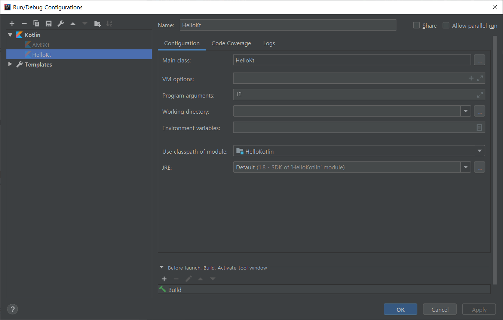

# Hello-Kotlin

## Kotlin 개요
- Kotlin은 JVM앱, 웹앱(JS), LLVM기반앱(네이티브), 동일한 기본 문법으로 다양한 플랫폼에 적용할 수 있다.
> LLVM : 저레벨 가상머신의 약자이며, 다양한 언어와 아키텍처에 대응하도록 지원하는 컴파일러 구조를 개발하는 프로젝트의 명칭.
> 네이티브 코틀린의 타깃 : ??
- 정적언어
- NPE에서 자유로운 언어 
- 함수형(람다식 사용)/객체지향 프로그래밍 가능
- 세미콜론 생략

## Kotlin 실습환경
- OpenJDK에는 여러 배포판이 있다, Azul사의 Zulu를 사용해보자
- IntelliJ 커뮤니티 버전을 깔자

## [Java와 다른점](https://kotlinlang.org/docs/reference/comparison-to-java.html)
- NPE를 방지하는 방법을 많이 추가했다? 물음표 하나면 끝난다?
- 다른건 아직 이해를 못하겠다
- 자바에 있는데 코틀린에 없는것 : 예외체크, 원시타입, Static members, Non-private fieds, 제네릭, 삼항연산자(a?b:c) <- 이거대신에 NPE막는 이상한 연산자가 추가되었다(a?:b, a가 null이면 b)

## [기본 문법](https://kotlinlang.org/docs/reference/basic-syntax.html)
- 패키지 import할 때 파일경로를 다 안 써도 된다. 알아서 찾는다. 어떻게?
- 프로그램 시작점은 main이다. 이건좀 알아먹겠네^^
- *함수* 함수의 파라미터, 반환값의 변수형을 정할 때는 `:`을 사용한다? 함수가 뭐이래?? 리턴 타입을 추상적으로 표현?? 반환이 의미가 없을 땐 `: Unit`인데, 생략할 수도 있다(그럴거면 왜?)
- *변수* 변수는 값을 변경할 수 없는 val형과, 할 수 있는 var로 나뉜다.
- *문자열 템플릿* $변수이름, ${토큰}
- [NULL-SAFETY](https://kotlinlang.org/docs/reference/null-safety.html)
- control flow
- ranges
- collections
- classes, objects, instances

- 함수형 언어
- 람다표현식
- 고계함수

## [Udecity Tutorial Course](https://classroom.udacity.com/courses/ud9011)

### Looping over arrays and lists
```kotlin
val numbers = arrayOf(11,12,13,14,15)
val tmpList = mutableListOf<String>()
for(i in numbers){
    tmpList.add(i.toString())
}
```
- Array생성하기
  - `arrayOf([element], ...)`
  - `arrayOfNulls([size :int])`
  - `Array([size]){[function returning intial value of each array element, arguments are its index]}`
```kotlin
// Creates an Array<String> with values ["0", "1", "4", "9", "16"]
val asc = Array(5) { i -> (i * i).toString() }
asc.forEach { println(it) }
```
- List생성하기 : 상동
- *for in loop* [생각보다 심오한 for loop의 세계](https://soulduse.tistory.com/71)
  - iterator
  - filter
  - range : `..`, `until`, `downTo`, `step`
- T : 제네릭타입
- Unit : java의 `void`에 대응, Unit은 단 하나의 인스턴스를 가지는 싱글톤객체.
- Nothing : "no value at all", 반환값 없는 함수에 쓸 수 있다. `Nothing` 표시 없으면 묵시적으로 `Unit`

### passing arguments through command-line
```kotlin
fun main(args: Array<String>) {
    val flag = args[0].toInt() //패키지 import해줘야함
    var msg = ""
    if(flag<12) msg = "good morning"
    else msg = "good night"
    println("$msg, kotlin")
}
```
- args[0] -> `java.lang.ArrayIndexOutOfBoundsException` : Run - Edit Configuration - Program argument
