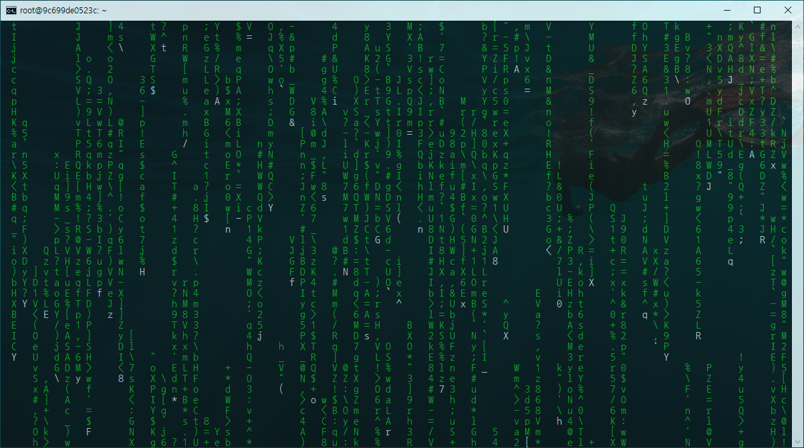
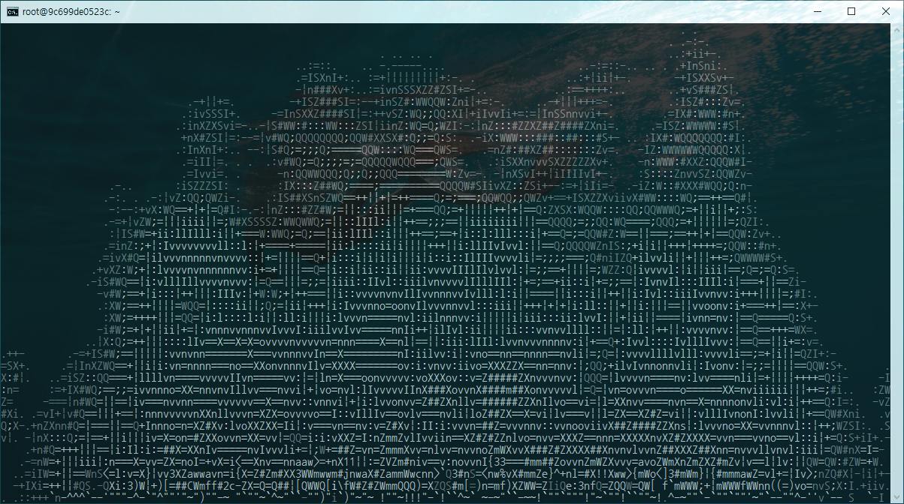

# Linux inside Docker

도커에서 LFS(Linux From Scratch)를 빌드하고, 나중에는 이를 바탕으로 초경량 도커 이미지를 만들어보자.  호스트 시스템으로 가장 친숙한 우분투를 골랐다. 도커허브에서 이미지를 다운받고 도커를 실행한다.

```
$ docker pull ubuntu
$ docker run -it ubuntu
$ docker start [ubuntu_contatiner]  # [ubuntu_container]는 container id | name
$ docker attach [ubuntu_container]  # git bash에선mintty로 설정했으면, 앞에 wintty를 붙인다
```

  

LFS 빌드에 앞서 먼저 알아둘 것들이다.([LFS - essential prereading](https://www.linuxfromscratch.org/hints/downloads/files/essential_prereading.txt))

- Unix-like OS의 작동방식
  
  - multi-user
    
  - file, file descriptor
    
  - process, process id
    
  - **bash (The Bourne Again Shell)** / :book: [The advanced scripting guide]([Advanced Bash-Scripting Guide (tldp.org)](https://tldp.org/LDP/abs/html/))
  
    
  
    - [핵심 Shell 커맨드 9개 살펴보기 - Parkito's on the way (shoark7.github.io)](https://shoark7.github.io/programming/shell-programming/Top-basic-unix-shell-command)
  
    - [새로운 리눅스 Shell 커맨드를 만났을 때 대처법 - Parkito's on the way (shoark7.github.io)](https://shoark7.github.io/programming/shell-programming/ways-to-search-information-for-linux-commands)
  
      ```
      $ whatis [명령어]  # 명령어 기능을 출력
      $ type [명령어]  # 명령어 종류를 출력 / 1은 쉘 빌트인 2는 리눅스 프로그램 3은 쉘 스크립트 4는 유저가 정의한 함수
      $ apropos [문자열]  # 입력한 문자열을 포함하는 whatis 출력들을 모두 출력
      $ [명령어] --help
      $ man [명령어]
      ```
  
    - [<중요> Shell: I/O Redirection - Parkito's on the way (shoark7.github.io)](https://shoark7.github.io/programming/shell-programming/IO-Redirection-in-Shell)
  
    - [유용한 쉘 명령어 소개 Part 1 - Parkito's on the way (shoark7.github.io)](https://shoark7.github.io/programming/shell-programming/Useful-shell-commands-1)

    - [alias: 나만의 쉘 커맨드 만들기 - Parkito's on the way (shoark7.github.io)](https://shoark7.github.io/programming/shell-programming/make-my-own-shell-commands)

      ```
      $ echo "alias gg='git add; git commit'" >> ~./bashrc
      $ source ~/.bashrc 
      ```
  
      쉘은 처음 실행될 때만 '.bashrc' 파일(쉘의 설정파일)을 읽기 때문에 alias 명령어로 입력한 내용은 쉘을 다시 실행해야 적용된다. 지금바로 적용하려면, 쉘 스크립트 파일을 실행하는 source 명령어로 '.bashrc'를 실행한다.
  
    - [<중요> Shell 확장 - Parkito's on the way (shoark7.github.io)](https://shoark7.github.io/programming/shell-programming/shell-expansions)

      | 문자 클래스 | 매칭문자           |
      | ----------- | ------------------ |
      | [:alnum:]   | 모든 알파벳과 숫자 |
      | [:alpha:]   | 모든 알파벳        |
      | [:digit:]   | 모든 숫자          |
      | [:lower:]   | 소문자 알파벳      |
      | [:upper:]   | 대문자 알파벳      |
  
      ```
      ## 와일드카드
      $ echo [[:lower:][:digit:]]*  # 파일이름이 소문자 알파벳이나 숫자인 경우
      $ echo [^[:lower:]]*          # 파일이름이 소문자 알파벳이 아닌 경우
      $ echo [abc]                  # 파일이름이 a,b,c 중 하나로 시작하는 경우
      $ echo {김, 이, 박}태영
      김태영 이태영 박태영
      $ echo {A..Z}
      A B C D (생략) X Y Z
      ```
  
      ```
      ## 수식확장
      $ echo (5+5)
      10
      $ testvariant=10
      $ echo $testvariant
      10
      $ echo testvariant is $testvariant!  ## ERROR
      $ echo testvariant is $((testvariant))!
      testvariant is 10
      ```
  
      ```
      ### 확장억제
      $ echo "$USER $((3*4)) \n $(date)"
      tae0 12 Wed Jul  7 05:21:21 UTC 2021
      $ echo "* {1..3} ~"
      * {1..3} ~
      
      $ echo '$USER $((3*4)) $(date) * {1..3} ~'
      $USER $((3*4)) $(date) * {1..3} ~
      ```
  
    - [유용한 쉘 명령어 소개 Part 2: find - Parkito's on the way (shoark7.github.io)](https://shoark7.github.io/programming/shell-programming/Useful-shell-commands-2-find)
  
    - [둘이 코딩하다 하나가 죽어도 모르는 유익한 쉘 기능 소개 - Parkito's on the way (shoark7.github.io)](https://shoark7.github.io/programming/shell-programming/useful-shell-features)
  
      - **[CTRL] + a** : 커서를 맨앞으로 이동
      - **[CTRL] + e** : 커서를 맨뒤로 이동
      - **[CTRL] + u** : 커서보다 앞의 커맨드를 모두삭제
      - **[CTRL] + k** : 커서보다 뒤의 커맨드를 모두삭제
  
  - :book: [Linux kernel user's and administrator's guide](https://www.kernel.org/doc/html/v5.7/admin-guide/index.html), [Linux Network Administrator's Guide](https://tldp.org/LDP/nag2/nag2.pdf)
  
  - :book: [Building and Installing Software Packages for Linux](http://wiki.kldp.org/wiki.php/LinuxdocSgml/Software-Building-HOWTO) / Autoconf, Automake, Libtoo 
  
    - [ubuntu apt-get 패키지 관리 명령어 사용법](https://wnw1005.tistory.com/365)
  
    - **GNU-Emacs 설치해보기**: 홈페이지 확인 → gzip 압축된 tar 파일로 소스코드 다운로드 → tar 및 gunzip으로 압축풀기 → README 파일 확인 → 설치 및 빌드
  
    - :trophy: **MPlayer 설치해보기**: 모든 종속성을 먼저 추적하고 설치해야하므로 좋은 도전과제임. 힌트는 [Beyond Linux From Scratch](https://www.linuxfromscratch.org/blfs/)를 참조
  
    - **cmatrix** 매트릭스처럼 초록색 글자가 쏟아져내리게 할 수 있다 
  
      
  
    - **aafire** 콘솔창에 불지르기
  
      
  
  - 새 부트로더를 테스트하기 전에 시스템을 부팅할 대체 수단이 있어야 한다. Grub, Lilo 관련문서를 잘 읽고 수행할 것.
  
- 기본 유틸리티
  - 파일 및 디렉토리 생성, 조회, 복사, 이름변경, 편집 및 삭제
  
    ```
    $ mkdir [디렉토리명]  # 디렉토리 생성
    $ mkdir -p [디렉토리명]/[파일명]  # 디렉토리/파일 생성
    $ rmdir [디렉토리명]  # 디렉토리 삭제
    $ touch [파일명]  # 파일 생성
    $ cat > [파일명]  # 표준입력을 파일에 입력
    $ vi [파일명]     # 종료는 [esc]버튼 누르고 q, [enter]
    $ rm -rf [파일명]  # 디렉토리/파일 강제삭제 반복
    ```
  
  - 디렉토리간 변경 및 현재 작업중인 디렉토리 조회
  
    ```
    $ cd [경로]  # 상위디렉토리는 .. 현재디렉토리는 .
    $ pwd  # 현재 작업중인 디렉토리 조회
    ```
  
  - 디렉토리에 따른 네이밍규칙
  
  - 표준 입출력과 매개인자, 파이프라인
  
    - [표준입출력이란(shoark7.github.io)](https://shoark7.github.io/programming/knowledge/what-is-standard-stream) 사용자가 다른 입출력 매체를 지정하지 않았을 때의 기본 입출력이다. 쉘 프로세스의 경우 키보드를 표준입력으로 받고 모니터 콘솔 출력을 표준출력으로 한다. (표준입출력은 부모 프로세스에 따른다. 그래서 쉘 명령어가 키보드/모니터콘솔을 표준입출력으로 가지는 것이다.)표준출력은 다시 일반 표준출력과 표준오류로 나뉘는데, 이 점을 활용하여 일반 로그와 오류 로그를 분리하여 파일에 담을 수도 있다.
    - `>`, `2>`, `>>`, `&>`, `|`

  


