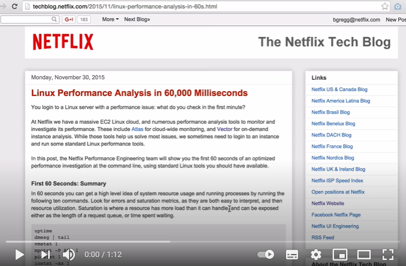
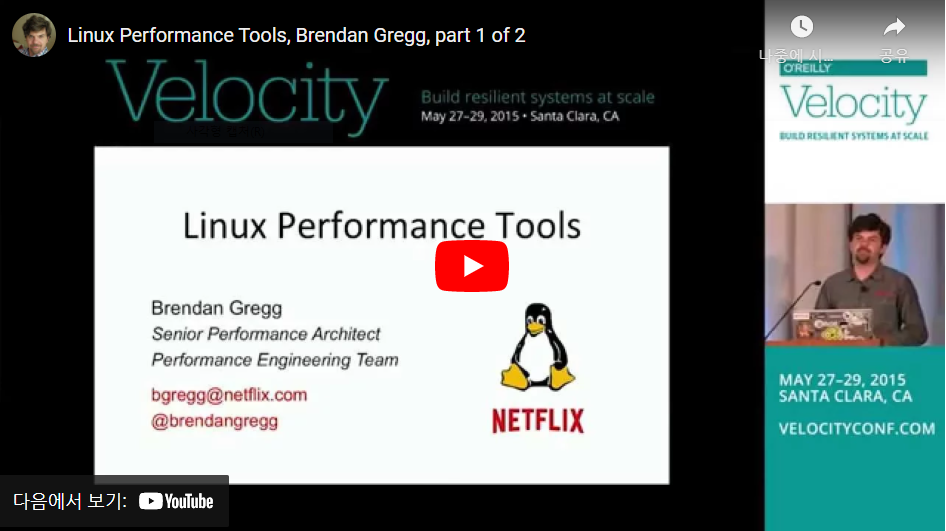

# Linux Performance Analysis

**Table of Contents**

- [Command](##-Commands)
  - [Linux Performance Analysis in 60,000 Milliseconds](###-Linux-Performance-Analysis-in-60,000-Milliseconds)
  - [Linux Performance Tools](###-Linux-Performance-Tools)
- [Framework](##-Framework)
- [Methodology](##-Methodology)
- [Exercise](##-Exercise)

리눅스 서버 성능을 모니터링하는 명령어, 프레임워크, 그리고 시스템 부하 테스트를 진행하는 방법론을 공부하고 정리하는 문서.

​    

   

## Commands

### Linux Performance Analysis in 60,000 Milliseconds

[Linux Performance Analysis in 60,000 Milliseconds | Netflix TechBlog](https://netflixtechblog.com/linux-performance-analysis-in-60-000-milliseconds-accc10403c55)
[Luavis' Dev Story - 리눅스 서버 60초안에 상황파악하기](https://luavis.me/server/linux-performance-analysis)

[](https://youtu.be/ZdVpKx6Wmc8)

넷플릭스는, 아마존 EC2 리눅스 서버를 사용하고 있다. 클라우드 전체를 모니터링 하는 데는 [Atlas](https://netflixtechblog.com/introducing-atlas-netflixs-primary-telemetry-platform-bd31f4d8ed9a)를 사용하고, EC2 인스턴스 하나를 살펴볼 때는 [Vector](https://netflixtechblog.com/introducing-vector-netflixs-on-host-performance-monitoring-tool-c0d3058c3f6f)를 사용한다. 대부분의 이슈는 이 툴을 사용해 대응할 수 있지만, 가끔 인스턴스에 직접 로그인해 리눅스 표준 성능체크 툴을 사용해야할 때가 있다.

이 글에서는 리눅스 표준 툴만으로 넷플릭스의 최적화된 성능 분석 과정의 첫 60초를 소개하고자 한다. 시스템 자원 사용량, 실행중인 프로세스 등 상황을 빠르게 이해할 수 있을 것이다. 먼저 어떤 오류가(Error) 발생했는지, 포화도(Saturation) 그래프는 어떤지 살펴보고, 자원 사용(Utilization) 부분을 확인하자. 명령어는 다음과 같으며, 일부는 먼저 sysstat 패키지를 설치해야 한다. 

```
$ uptime
$ dmesg | tail
$ vmstat 1
$ mpstat -p ALL 1
$ pidstat 1
$ iostat -xz 1
$ free -m
$ sar -n DEV 1
$ sar -n TCP,ETCP 1
$ top
```

이 측정방법은 USE Method라고 불리는, 병목현상이 생기는 위치를 찾는 방법론의 일부분이다. USE는 CPU, memory, disk 등 모든 자원에 대해 Utilization, saturation, error를 측정하는 방법이다.

실제로 자신의 리눅스 인스턴스에서 sysstat으로 성능을 확인하고 싶다면, 다음과 같이 패키지 사용을 활성화하고 성능확인 주기를 지정해주어야 한다.

```
$ sudo apt-get install sysstat
$ sudo vi /etc/default/sysstat  # ENABLED="false"를 "true"로 변경
$ sudo vi /etc/cron.d/sysstat   # 성능확인 주기를 설정
$ sudo service sysstat restart  # 재시작
```

USE 방법론으로 시스템을 분석할 방법은 아주 많다. 자세한 내용은 [USE Method: Linux Performance Checklist (brendangregg.com)](https://www.brendangregg.com/USEmethod/use-linux.html) 블로그를 참고.

| component           | type        | metric                                                       |
| ------------------- | ----------- | ------------------------------------------------------------ |
| CPU                 | utilization | system-wide: `vmstat 1`, "us" + "sy" + "st"; `sar -u`, sum fields except "%idle" and "%iowait"; `dstat -c`, sum fields except "idl" and "wai"; per-cpu: `mpstat -P ALL 1`, sum fields except "%idle" and "%iowait"; `sar -P ALL`, same as `mpstat`; per-process: `top`, "%CPU"; `htop`, "CPU%"; `ps -o pcpu`; `pidstat 1`, "%CPU"; per-kernel-thread: `top`/`htop` ("K" to toggle), where VIRT == 0 (heuristic). [1] |
| CPU                 | saturation  | system-wide: `vmstat 1`, "r" > CPU count [2]; `sar -q`, "runq-sz" > CPU count; `dstat -p`, "run" > CPU count; per-process: /proc/PID/schedstat 2nd field (sched_info.run_delay); `perf sched latency` (shows "Average" and "Maximum" delay per-schedule); dynamic tracing, eg, SystemTap schedtimes.stp "queued(us)" [3] |
| CPU                 | errors      | `perf` (LPE) if processor specific error events (CPC) are available; eg, AMD64's "04Ah Single-bit ECC Errors Recorded by Scrubber" [4] |
| Memory capacity     | utilization | system-wide: `free -m`, "Mem:" (main memory), "Swap:" (virtual memory); `vmstat 1`, "free" (main memory), "swap" (virtual memory); `sar -r`, "%memused"; `dstat -m`, "free"; `slabtop -s c` for kmem slab usage; per-process: `top`/`htop`, "RES" (resident main memory), "VIRT" (virtual memory), "Mem" for system-wide summary |
| Memory capacity     | saturation  | system-wide: `vmstat 1`, "si"/"so" (swapping); `sar -B`, "pgscank" + "pgscand" (scanning); `sar -W`; per-process: 10th field (min_flt) from /proc/PID/stat for minor-fault rate, or dynamic tracing [5]; OOM killer: `dmesg | grep killed` |
| Memory capacity     | errors      | `dmesg` for physical failures; dynamic tracing, eg, SystemTap uprobes for failed malloc()s |
| Network Interfaces  | utilization | `sar -n DEV 1`, "rxKB/s"/max "txKB/s"/max; `ip -s link`, RX/TX tput / max bandwidth; /proc/net/dev, "bytes" RX/TX tput/max; nicstat "%Util" [6] |
| Network Interfaces  | saturation  | `ifconfig`, "overruns", "dropped"; `netstat -s`, "segments retransmited"; `sar -n EDEV`, *drop and *fifo metrics; /proc/net/dev, RX/TX "drop"; nicstat "Sat" [6]; dynamic tracing for other TCP/IP stack queueing [7] |
| Network Interfaces  | errors      | `ifconfig`, "errors", "dropped"; `netstat -i`, "RX-ERR"/"TX-ERR"; `ip -s link`, "errors"; `sar -n EDEV`, "rxerr/s" "txerr/s"; /proc/net/dev, "errs", "drop"; extra counters may be under /sys/class/net/...; dynamic tracing of driver function returns 76] |
| Storage device I/O  | utilization | system-wide: `iostat -xz 1`, "%util"; `sar -d`, "%util"; per-process: iotop; `pidstat -d`; /proc/PID/sched "se.statistics.iowait_sum" |
| Storage device I/O  | saturation  | `iostat -xnz 1`, "avgqu-sz" > 1, or high "await"; `sar -d` same; LPE block probes for queue length/latency; dynamic/static tracing of I/O subsystem (incl. LPE block probes) |
| Storage device I/O  | errors      | /sys/devices/.../ioerr_cnt; `smartctl`; dynamic/static tracing of I/O subsystem response codes [8] |
| Storage capacity    | utilization | swap: `swapon -s`; `free`; /proc/meminfo "SwapFree"/"SwapTotal"; file systems: "df -h" |
| Storage capacity    | saturation  | not sure this one makes sense - once it's full, ENOSPC       |
| Storage capacity    | errors      | `strace` for ENOSPC; dynamic tracing for ENOSPC; /var/log/messages errs, depending on FS |
| Storage controller  | utilization | `iostat -xz 1`, sum devices and compare to known IOPS/tput limits per-card |
| Storage controller  | saturation  | see storage device saturation, ...                           |
| Storage controller  | errors      | see storage device errors, ...                               |
| Network controller  | utilization | infer from `ip -s link` (or /proc/net/dev) and known controller max tput for its interfaces |
| Network controller  | saturation  | see network interface saturation, ...                        |
| Network controller  | errors      | see network interface errors, ...                            |
| CPU interconnect    | utilization | LPE (CPC) for CPU interconnect ports, tput / max             |
| CPU interconnect    | saturation  | LPE (CPC) for stall cycles                                   |
| CPU interconnect    | errors      | LPE (CPC) for whatever is available                          |
| Memory interconnect | utilization | LPE (CPC) for memory busses, tput / max; or CPI greater than, say, 5; CPC may also have local vs remote counters |
| Memory interconnect | saturation  | LPE (CPC) for stall cycles                                   |
| Memory interconnect | errors      | LPE (CPC) for whatever is available                          |
| I/O interconnect    | utilization | LPE (CPC) for tput / max if available; inference via known tput from iostat/ip/... |
| I/O interconnect    | saturation  | LPE (CPC) for stall cycles                                   |
| I/O interconnect    | errors      | LPE (CPC) for whatever is available                          |

| component        | type        | metric                                                       |
| ---------------- | ----------- | ------------------------------------------------------------ |
| Kernel mutex     | utilization | With CONFIG_LOCK_STATS=y, /proc/lock_stat "holdtime-totat" / "acquisitions" (also see "holdtime-min", "holdtime-max") [8]; dynamic tracing of lock functions or instructions (maybe) |
| Kernel mutex     | saturation  | With CONFIG_LOCK_STATS=y, /proc/lock_stat "waittime-total" / "contentions" (also see "waittime-min", "waittime-max"); dynamic tracing of lock functions or instructions (maybe); spinning shows up with profiling (`perf record -a -g -F 997 ...`, `oprofile`, dynamic tracing) |
| Kernel mutex     | errors      | dynamic tracing (eg, recusive mutex enter); other errors can cause kernel lockup/panic, debug with kdump/`crash` |
| User mutex       | utilization | `valgrind --tool=drd --exclusive-threshold=...` (held time); dynamic tracing of lock to unlock function time |
| User mutex       | saturation  | `valgrind --tool=drd` to infer contention from held time; dynamic tracing of synchronization functions for wait time; profiling (oprofile, PEL, ...) user stacks for spins |
| User mutex       | errors      | `valgrind --tool=drd` various errors; dynamic tracing of pthread_mutex_lock() for EAGAIN, EINVAL, EPERM, EDEADLK, ENOMEM, EOWNERDEAD, ... |
| Task capacity    | utilization | `top`/`htop`, "Tasks" (current); `sysctl kernel.threads-max`, /proc/sys/kernel/threads-max (max) |
| Task capacity    | saturation  | threads blocking on memory allocation; at this point the page scanner should be running (sar -B "pgscan*"), else examine using dynamic tracing |
| Task capacity    | errors      | "can't fork()" errors; user-level threads: pthread_create() failures with EAGAIN, EINVAL, ...; kernel: dynamic tracing of kernel_thread() ENOMEM |
| File descriptors | utilization | system-wide: `sar -v`, "file-nr" vs /proc/sys/fs/file-max; `dstat --fs`, "files"; or just /proc/sys/fs/file-nr; per-process: `ls /proc/PID/fd | wc -l` vs `ulimit -n` |
| File descriptors | saturation  | does this make sense? I don't think there is any queueing or blocking, other than on memory allocation. |
| File descriptors | errors      | `strace` errno == EMFILE on syscalls returning fds (eg, open(), accept(), ...). |

### 1. uptime

```
$ uptime
23:51:26 up 21:31, 1 user, load average: 30.02, 26.43, 19.02
```

load average값을 확인하는 가장 쉬운 방법이다. `uptime`은 시스템이 실행되고 시간이 얼마나 지났는지, 시스템에 로그인된 사용자 수와 load average를 출력한다.  load average는 1분 평균, 5분 평균, 15분 평균으로 보여준다. 만약 앞의 값이 뒤의 값보다 낮다면, 너무 늦게 로그인한 것이다.

load는 처리를 기다리는 프로세스 상태인데, CPU 코어당 1을 기준으로 1 이상이면 대기시간이 있는 것이고 1 미만이면 여유가 있다는 뜻이다. CPU 코어가 1개면 1을 기준으로, 2개면 2를 기준으로 본다. `uptime`말고 다른 명령어로도 확인할 수 있다.

```
# cat /proc/loadavg                  # load average 출력
# /proc/cpuinfo | grep name | wc -l  # CPU 코어 수 세기
# sar -q                             # load average 이력보기
```

load average가 높으면 CPU 수요에 문제가 있을 거라 추측되지만, load average와 cpu 사용률, 메모리 사용률을 종합적으로 평가해야 한다. 뒤이어 나오는 vmstat이나 mpstat 명령어로 더 자세히 확인해보자.

### 2. dmesg | tail

```
$ dmesg | tail
[1880957.563150] perl invoked oom-killer: gfp_mask=0x280da, order=0, oom_score_adj=0
[...]
[1880957.563400] Out of memory: Kill process 18694 (perl) score 246 or sacrifice child
[1880957.563408] Killed process 18694 (perl) total-vm:1972392kB, anon-rss:1953348kB, file-rss:0kB
[2320864.954447] TCP: Possible SYN flooding on port 7001. Dropping request.  Check SNMP counters.
```

dmesg는 시스템 메시지를 확인할 수 있는 명령어다. 부팅시부터 모든 커널메시지가 출력되기 때문에 tail로 마지막 10줄만 출력했다. 이 메시지로 성능에 문제를 줄 수 있는 에러를 찾을 수 있었는데 위 예제에서는 `oom-killer(out of memory)`와 TCP request가 드랍된 것을 알 수 있다.

리눅스 로그파일은 `syslogd`에 의해 제어되며, 설정파일 `/etc/syslog.conf`를 수정하여 저장위치와 파일명을 바꿀 수 있다. 리눅스 로그는 여러 종류가 있다.  우리는 이중에서 커널부트메시지로그를 확인한 것이다.

| 로그이름               | 로그파일명                | 관련 데몬            | 설명                                                         |
| ---------------------- | ------------------------- | -------------------- | ------------------------------------------------------------ |
| 커널로그               | /dev/console              | kernel               | 콘솔에 뿌려지는 로그                                         |
| 시스템로그             | /var/log/messages         | syslogd              | 리눅스 커널로그 및 주된 로그                                 |
| 보안로그               | /var/log/secure           | xinted               | 보안 인증 관련 로그                                          |
| 메일로그               | /var/log/mailing          | sendmail<br />popper | 메일로그<br />(sendmail에 의한로그)                          |
| 크론로그               | /var/log/cron             | crond                | crond에 의한 로그                                            |
| 부팅로그               | /var/log/boot.log         | kernel               | 시스템 부팅시 로그                                           |
| **커널부트메시지로그** | **/var/dmesg**            | **kernel**           | **시스템이 부팅될때 커널이 장치를 읽어들이며 출력하는 메시지** |
| 커널로그               | /var/log/wtmp             | kernel               | 시스템 전체 로그인기록                                       |
| 커널로그               | /var/log/utmp             | kernel               | 현재 로그인 사용자에 대한 기록, 사용자 ip저장                |
| FTP로그                | /var/log/xferlog          | ftpd                 | ftp로그                                                      |
| 웹로그                 | /var/log/httpd/access_log | httpd                | 아파치(웹서버) 로그저장                                      |
| 웹로그                 | /var/log/httpd/error_log  | httpd                | 아파치(웹서버) 로그저장                                      |
| 네임서버로그           | /var/log/named.log        | named                | 네임서버(DNS) 로그                                           |

https://dinding.tistory.com/8

커널부트메시지로그는 앞서 말했듯이 커널이 장치를 제대로 인식하고 작동하고 있는지 확인할 수 있는 로그이다. 아래 dmesg는 x86 시스템이 부팅된 직후에 출력한 것이다. 부가설명은 #로 시작한다. 보이는 것처럼 시스템에 연결된 장치를 모두 검사하고 그 결과를 알려준다.

```
Linux version 2.2.14-5.0 (root@porky.devel.redhat.com) (gcc version egcs-2.91.66 19990314/Linux (egcs-1.1.2 release)) #1 Tue Mar 7 20:53:41 EST 2000
# 가장먼저 커널버전과 빌드정보(언제 빌드됐고 무엇으로 컴파일했고 누가 빌드했는지 등)를 출력한다. 

Detected 300683434 Hz processor.
# K6/2-300 프로세서가 300MHz로 작동하고 있다.

Console: colour VGA+ 80x25
# 표준 PC 콘솔스크린 (15인치 모니터)

Calibrating delay loop... 599.65 BogoMIPS
# BogoMIPS가 제공하는 벤치마크인데 쓸모없다. BogoMIPS는 Linux 커널 0.99.11(1993.7.11.) 시절 일부 드라이버가 하드웨어를 기다리는 데 필요한 시간을 벌기위해 만들어졌다. Bogo 가짜, Million Instructions Per Second 초당 백만번 연산을 수행한다는 뜻으로, 문자그대로 특정 연산을 백만번 수행하며 시스템을 대기시킨다. 이 문구가 커널 부트로그에 포함된 이유는 Linus가 사람들이 곤혹스러워하는 모습을 보길 좋아했기 때문이라고 한다. BogoMIPS가 시스템 성능을 비교하는 절대적인 지표가 될 수는 없다는 점에 주의. 현재는 udelqy로(2012) CPU 내장 시스템 타이머를 사용한다. 

Memory: 63008k/65536k available (1084k kernel code, 412k reserved, 968k data, 64k init, 0k bigmem)
# 메모리 수치, 64MB 메모리를 가지고 있다

Dentry hash table entries: 262144 (order 9, 2048k)
# dentry cache (dcache)는 커널 관점에서 마운트한 파일시스템의 네임스페이스를 보여준다. 커널 소스트리에서 Documentation/filesystems/vfs.txt에 잘 문서화되어 있다.

Buffer cache hash table entries: 65536 (order 6, 256k)
# 2.2커널에서는 buffer cache로 캐싱하거나 데이터를 합쳐서 블록 디바이스에 쓰기 작업을 한다. 2.3.6이후부터는 inode 같은 메타데이터를 캐싱하는데 쓴다. 파일디스크립터는 파일시스템에 저장되지 않고 시스템콜이 호출될때 동적으로 생성한다. 커널 메모리 안에 커널별 파일 디스크립터 테이블에 저장되며, 파일 디스크립터는 프로세스 아이디와 함께 있어야 시스템 자원을 나타낼 수 있다. 반면 아이노드는 파일시스템 내부에 저장되며 언제나 장치 어딘가의 무엇을 가리키고 있다. 아이노드 번호로는 파일을 특정할 수 있는데, 다만 마운트된 서로 다른 디스크에서 같은 아이노드 번호를 가질 수도 있다.

Page cache hash table entries: 16384 (order 4, 64k)
# 2.2커널에서 page (VM) cache는 스왑 캐싱, 데이터를 읽고 mmap하는 데 사용합니다. 2.3.6이후로는 데이터 쓰기 작업에도 사용됩니다.

VFS: Diskquotas version dquot_6.4.0 initialized
# quotas를 지원하고 있다는 뜻..(파일시스템 또는 유저간 사용할 디스크용량과 파일을 제한하는 도구)

CPU: AMD AMD-K6(tm) 3D processor stepping 00
# 프로세서

Checking 386/387 coupling... OK, FPU using exception 16 error reporting.
Checking 'hlt' instruction... OK.
# Intel 프로세서 관련 이슈가 있어 확인하는 내용

POSIX conformance testing by UNIFIX
PCI: PCI BIOS revision 2.10 entry at 0xfb490
# 주변기기를 위한 PCI 버스 탐색

PCI: Using configuration type 1
PCI: Probing PCI hardware
PCI: 00:38 [1106/0586]: Work around ISA DMA hangs (00)
Activating ISA DMA hang workarounds.
Linux NET4.0 for Linux 2.2
# NET4.0을 지원한다

Based upon Swansea University Computer Society NET3.039
NET4: Unix domain sockets 1.0 for Linux NET4.0.
NET4: Linux TCP/IP 1.0 for NET4.0
IP Protocols: ICMP, UDP, TCP, IGMP
# IP 프로토콜

TCP: Hash tables configured (ehash 65536 bhash 65536)
Initializing RT netlink socket
Starting kswapd v 1.5
Detected PS/2 Mouse Port.
# 뻔한 내용

Serial driver version 4.27 with MANY_PORTS MULTIPORT SHARE_IRQ enabled
ttyS00 at 0x03f8 (irq = 4) is a 16550A
ttyS01 at 0x02f8 (irq = 3) is a 16550A
# 직렬 포트에 관한 내용

pty: 256 Unix98 ptys configured
apm: BIOS version 1.2 Flags 0x07 (Driver version 1.9)
# APM 표준을 지원한다

Real Time Clock Driver v1.09
RAM disk driver initialized: 16 RAM disks of 4096K size
# RAM 디스크도 지원한다


VP_IDE: IDE controller on PCI bus 00 dev 39
VP_IDE: not 100% native mode: will probe irqs later
ide0: BM-DMA at 0xe000-0xe007, BIOS settings: hda:DMA, hdb:DMA
ide1: BM-DMA at 0xe008-0xe00f, BIOS settings: hdc:DMA, hdd:DMA
# IDE 콘트롤러

hda: Maxtor 51369U3, ATA DISK drive
# 하드드라이브

hdb: IDE/ATAPI CD-ROM 32X, ATAPI CDROM drive
# CD롬 드라이브

ide0 at 0x1f0-0x1f7,0x3f6 on irq 14
hda: Maxtor 51369U3, 12949MB w/2048kB Cache, CHS=6577/64/63
hdb: ATAPI 16X CD-ROM drive, 128kB Cache
# 디스크 정보

Uniform CDROM driver Revision: 2.56
Floppy drive(s): fd0 is 1.44M
FDC 0 is a post-1991 82077
# 플로피디스크 정보

md driver 0.90.0 MAX_MD_DEVS=256, MAX_REAL=12
raid5: measuring checksumming speed
raid5: MMX detected, trying high-speed MMX checksum routines
pII_mmx : 761.238 MB/sec
p5_mmx : 726.567 MB/sec
8regs : 447.675 MB/sec
32regs : 308.610 MB/sec
using fastest function: pII_mmx (761.238 MB/sec)
# RAID와 MD정보

scsi : 0 hosts.
scsi : detected total.
# SCSI도 지원한다

md.c: sizeof(mdp_super_t) = 4096
Partition check:
hda: hda1 hda2 < hda5 hda6 >
# 디스크 파티션 정보, 괄호는 확장된 파티션

autodetecting RAID arrays
autorun ...
... autorun DONE.
# RAID

VFS: Mounted root (ext2 filesystem) readonly.
# 이 시점에서 커널은 준비가 거의 끝났고, 시스템을 시작할 준비가 됐다

Freeing unused kernel memory: 64k freed
Adding Swap: 66488k swap-space (priority -1)
ne2k-pci.c:vpre-1.00e 5/27/99 D. Becker/P. Gortmaker http://cesdis.gsfc.nasa.gov/linux/drivers/ne2k-pci.html
ne2k-pci.c: PCI NE2000 clone 'RealTek RTL-8029' at I/O 0xe800, IRQ 11.
eth0: RealTek RTL-8029 found at 0xe800, IRQ 11, 00:80:AD:41:22:10.
# 이더넷 장치는 PCI NE2000 기반(정말싼 NIC고 거의모든 OS에서 지원한다)

VFS: Disk change detected on device fd(2,0)
# 자 이제, 커널은 부팅을 끝냈다. 이제 /sbin/init을 시작할 준비가 끝났다. 시스템은 이제 rc.sysinit을 실행하고 일반적인 부팅 작업을 수행한다.
```

https://linuxgazette.net/issue59/nazario.html

### 3. vmstat 1

```
$ vmstat 1
procs ---------memory---------- ---swap-- -----io---- -system-- ------cpu-----
 r  b swpd   free   buff  cache   si   so    bi    bo   in   cs us sy id wa st
34  0    0 200889792  73708 591828    0    0     0     5    6   10 96  1  3  0  0
32  0    0 200889920  73708 591860    0    0     0   592 13284 4282 98  1  1  0  0
32  0    0 200890112  73708 591860    0    0     0     0 9501 2154 99  1  0  0  0
32  0    0 200889568  73712 591856    0    0     0    48 11900 2459 99  0  0  0  0
32  0    0 200890208  73712 591860    0    0     0     0 15898 4840 98  1  1  0  0
^C
```

virtual memory stat의 약자이다. 1을 인자로 넘기면 1초마다 정보를 뿌려준다. 첫번째 라인은 부팅 이후의 평균적인 값이다. 

**확인해봐야 할 항목**

- **r**: CPU에서 동작중인 프로세스의 숫자. I/O를 포함하지 않아 CPU 자원 포화(saturation)가 발생하는지 확인할때에 좋은 값. `r` 값이 CPU 개수보다 크면 포화상태라고 보면 된다.
- **free**: free memory를 kb단위로 나타냄. 숫자가 크면 클수록 메모리에 여유가 있다는 뜻이다. `free -m`를 이용하면 조금더 편하게 확인할 수 있다.
- **si, so**: swap-in과 swap-out에 대한 값. 0이 아니라면 현재 시스템에 메모리가 부족한것이다.
- **us, sy, id, wa, st**: 모든 CPU의 평균적인 CPU time을 측정한다. 각각 user time, 커널에서 사용되는 system time, idle, wait I/O 그리고 stolen time순이다(stolen time은 hypervisor가 가상 CPU를 서비스 하는 동안 실제 CPU를 차지한 시간이다.)

각항목별 의미는 아래와 같다.

- **procs 필드**
  - r : cpu 접근 대기 중인 실행 가능한 프로세스 수
  - b : I/O 자원을 할당 받지 못해 블록 된 프로세스의 수
- **memory 필드**
  - swapd : 사용된 가상 메모리의 용량
  - free : 사용가능한 여유 메모리의 용량
  - buffer : 버퍼에 사용된 메모리의 총량
  - cache : 페이지 캐시에 사용된 메모리의 용량
- **swap 필드**
  - si : swap-in 된 메모리의 양 (kb)
  - so : swap-out 된 메모리의 양 (kb). 스왑 아웃이 지속적으로 발생하였다면 메모리 부족을 의심 해 볼수 있습니다.
- **I/O 필드**
  - bi: 블록 디바이스로 부터 입력 블록수
  - bo: 블록 디바이스에 쓰기 블록수
- **system 필드**
  - in : 초당 발생한 interrupts의 수
  - cs : 초당 발생한 context switches(문맥교환) 수
- **CPU 필드**
  - us : CPU가 사용자 수준 코드를 실행한 시간(단위%)
  - sy : CPU가 시스템 수준 코드를 실행한 시간(단위(%)
  - id : idle 시간
  - wa : IO wait 시간


https://blog.cafe24.com/2004

### 4. mpstat -p ALL 1

```
$ mpstat -P ALL 1
Linux 3.13.0-49-generic (titanclusters-xxxxx)  07/14/2015  _x86_64_ (32 CPU)

07:38:49 PM  CPU   %usr  %nice   %sys %iowait   %irq  %soft  %steal  %guest  %gnice  %idle
07:38:50 PM  all  98.47   0.00   0.75    0.00   0.00   0.00    0.00    0.00    0.00   0.78
07:38:50 PM    0  96.04   0.00   2.97    0.00   0.00   0.00    0.00    0.00    0.00   0.99
07:38:50 PM    1  97.00   0.00   1.00    0.00   0.00   0.00    0.00    0.00    0.00   2.00
07:38:50 PM    2  98.00   0.00   1.00    0.00   0.00   0.00    0.00    0.00    0.00   1.00
07:38:50 PM    3  96.97   0.00   0.00    0.00   0.00   0.00    0.00    0.00    0.00   3.03
[...]
```

CPU별로 CPU time을 측정할 수 있다. 균형있는 상태로 작동하고 있는지 확인할 수 있는데, 한 CPU만 일하고 있다는 말은 프로그램이 single thread로 동작한다는 뜻이다.

### 5. pidstat 1

```
$ pidstat 1
Linux 3.13.0-49-generic (titanclusters-xxxxx)  07/14/2015    _x86_64_    (32 CPU)

07:41:02 PM   UID       PID    %usr %system  %guest    %CPU   CPU  Command
07:41:03 PM     0         9    0.00    0.94    0.00    0.94     1  rcuos/0
07:41:03 PM     0      4214    5.66    5.66    0.00   11.32    15  mesos-slave
07:41:03 PM     0      4354    0.94    0.94    0.00    1.89     8  java
07:41:03 PM     0      6521 1596.23    1.89    0.00 1598.11    27  java
07:41:03 PM     0      6564 1571.70    7.55    0.00 1579.25    28  java
07:41:03 PM 60004     60154    0.94    4.72    0.00    5.66     9  pidstat

07:41:03 PM   UID       PID    %usr %system  %guest    %CPU   CPU  Command
07:41:04 PM     0      4214    6.00    2.00    0.00    8.00    15  mesos-slave
07:41:04 PM     0      6521 1590.00    1.00    0.00 1591.00    27  java
07:41:04 PM     0      6564 1573.00   10.00    0.00 1583.00    28  java
07:41:04 PM   108      6718    1.00    0.00    0.00    1.00     0  snmp-pass
07:41:04 PM 60004     60154    1.00    4.00    0.00    5.00     9  pidstat
^C
```

pidstat은 process당 top 명령을 수행하는 것과 비슷하다. 차이점은 화면을 매번 갱신하는대신 누적해서 결과를 보여주기에 상황변화를 기록하기에 좋다는 것이다. %CPU 항목은 해당 프로세스의 전체 CPU 사용률을 나타낸다. 1개 CPU를 사용하면 100%이므로, 1591%란 수치는 java process가 거의 CPU 16개를 점유하고 있다는 뜻이다. 각 항목별 의미는 다음과 같다.

- %usr : 해당 Process의 App Code를 구동하는데 이용한 CPU 사용률을 나타낸다.
- %system : 해당 Process의 Kernel Code를 구동하는데 이용한 CPU 사용률을 나타낸다.
- %guest : 해당 Process가 Hypervisor일 경우 vCPU를 구동하기 위한 CPU 사용률을 나타낸다.
- %wait : 해당 Process를 구동하기 위한 CPU 대기률을 나타낸다.
- %CPU : 해당 Process의 전체 CPU 사용률을 나타낸다.
- CPU : 해당 Process가 동작하는 CPU Core를 나타낸다.

https://ssup2.github.io/command_tool/pidstat/

### 6. iostat -xz 1

```
$ iostat -xz 1
Linux 3.13.0-49-generic (titanclusters-xxxxx)  07/14/2015  _x86_64_ (32 CPU)

avg-cpu:  %user   %nice %system %iowait  %steal   %idle
          73.96    0.00    3.73    0.03    0.06   22.21

Device:   rrqm/s   wrqm/s     r/s     w/s    rkB/s    wkB/s avgrq-sz avgqu-sz   await r_await w_await  svctm  %util
xvda        0.00     0.23    0.21    0.18     4.52     2.08    34.37     0.00    9.98   13.80    5.42   2.44   0.09
xvdb        0.01     0.00    1.02    8.94   127.97   598.53   145.79     0.00    0.43    1.78    0.28   0.25   0.25
xvdc        0.01     0.00    1.02    8.86   127.79   595.94   146.50     0.00    0.45    1.82    0.30   0.27   0.26
dm-0        0.00     0.00    0.69    2.32    10.47    31.69    28.01     0.01    3.23    0.71    3.98   0.13   0.04
dm-1        0.00     0.00    0.00    0.94     0.01     3.78     8.00     0.33  345.84    0.04  346.81   0.01   0.00
dm-2        0.00     0.00    0.09    0.07     1.35     0.36    22.50     0.00    2.55    0.23    5.62   1.78   0.03
[...]
```

block device(HDD, SDD, …)가 어떻게 동작하는지 이해하기 좋은 툴이다.

> character device는 키보드, 마웃, 모니터, 프린터 등 byte 단위로 데이터를 전송하고, block device는 블록이나 섹터 등 정해진 단위로 데이터를 전송합니다.

**확인해봐야할 항목**

- r/s, w/s rkB/s, wkB/s: read 요청과 write 요청, read kB/s, write kB/s를 나타낸다. 어떤 요청이 가장 많이 들어오는지 확인해볼 수 있는 중요한 지표다. 성능 문제는 생각보다 과도한 요청때문에 발생하는 경우도 있기 때문이다.
- await: I/O처리 평균 시간을 밀리초로 표현한 값이다. application한테는 I/O요청을 queue하고 서비스를 받는데 걸리는 시간이기 때문에 application이 이 시간동안 대기하게 된다. 일반적인 장치의 요청 처리 시간보다 긴 경우에는 블럭장치 자체의 문제가 있거나 장치가 포화된 상태임을 알 수 있다.

각 항목별 의미는 다음과 같다.

- CPU 사용자원 출력정보
  - %user - 유저가 사용한 프로세스를 수행한 시간의 비율.
  - %nice - 작업 우선순위 정책에 의하여 우선순위가 바뀐 프로세서가 사용한 시간의 비율.
  - %system - 시스템이 작동한 시간의 비율.
  - %iowait - 입출력 대기시간 비율
  - %steal - Steal CPU의 사용시간 비율.
  - %idle - 입출력 대기시간을 제외한 유휴시간 비율.
- 디스크 장치의 활용량
  - tps - 초당 처리한 입출력 작업 개수
  - kB-read/s - 초당 읽어들인 데이터 블록
  - kB_wrtn/s - 초당 쓴 데이터 블록
  - kB_wrtn - 쓰기 작업한 데이터 블록

### 7. free -m

```
$ free -m
             total       used       free     shared    buffers     cached
Mem:        245998      24545     221453         83         59        541
-/+ buffers/cache:      23944     222053
Swap:            0          0          0
```

**확인해봐야할 항목**

- buffers: Block 장치 I/O의 buffer 캐시, 사용량
- cached: 파일 시스템에서 사용되는 [page cache](https://brunch.co.kr/@alden/25)의 양

위 값들이 0에 가까워 지면 안된다. 이는 곧 높은 Disk I/O가 발생하고 있음을 의미한다(iostat으로 확인 가능). 위 예제는 각각 59MB, 541MB로 괜찮은 정도에 속한다.

“-/+ buffers/cache”는 사용중인 메모리와 여유 메모리의 양을 나타낸다. 리눅스는 빠르게 다시 애플리케이션에 메모리가 할당될 수 있도록 캐시메모리를 사용한다. 따라서 캐시 메모리도 여유 메모리에 포함되어 보여야한다. 캐시메모리 또한 여유메모리로 계산하지 않는 착각으로 인해서 [linuxatemyram](http://www.linuxatemyram.com/)란 사이트까지 있다.

`top`이나 `buffer`에 "buffer"나 "cache"라고 표현되는 메모리가 아래 표의 두번째 행이다. 리눅스는 디스크 캐싱을 위해 사용하지 않는 메모리를 빌려서 사용하는데, 응용 프로그램에 메모리가 필요하면 디스크 캐시가 빌린 영역을 반납한다. 디스크 캐싱은 응용 프로그램이 현재 원하지 않는 메모리만 빌려 사용하므로, 메모리가 부족해 디스크를 가상메모리처럼 사용해야 하는 등 더 많은 스왑이 일어나는 것이 아니다.

| Memory that is                      | You'd call it           | Linux calls it           |
| ----------------------------------- | ----------------------- | ------------------------ |
| used by applications                | Used                    | Used                     |
| **used, but can be made available** | **Free (or Available)** | **Used (and Available)** |
| not used for anything               | Free                    | Free                     |

**언제부터 걱정을 해야하나요?**

- free가 0에 가까울 때
- used가 total에 가까울 때
- available 메모리(또는 "free + buffer/cache")가 0에 가까울 때
- swap used 증가 또는 변동
- `dmesg | grep oom-killer` 에서 OutOfMemory 킬러가 뜰 때

:trophy: [Experiments and fun with the Linux disk cache (linuxatemyram.com)](https://www.linuxatemyram.com/play.html)

### 8. sar -n DEV 1

```
$ sar -n DEV 1
Linux 3.13.0-49-generic (titanclusters-xxxxx)  07/14/2015     _x86_64_    (32 CPU)

12:16:48 AM     IFACE   rxpck/s   txpck/s    rxkB/s    txkB/s   rxcmp/s   txcmp/s  rxmcst/s   %ifutil
12:16:49 AM      eth0  18763.00   5032.00  20686.42    478.30      0.00      0.00      0.00      0.00
12:16:49 AM        lo     14.00     14.00      1.36      1.36      0.00      0.00      0.00      0.00
12:16:49 AM   docker0      0.00      0.00      0.00      0.00      0.00      0.00      0.00      0.00

12:16:49 AM     IFACE   rxpck/s   txpck/s    rxkB/s    txkB/s   rxcmp/s   txcmp/s  rxmcst/s   %ifutil
12:16:50 AM      eth0  19763.00   5101.00  21999.10    482.56      0.00      0.00      0.00      0.00
12:16:50 AM        lo     20.00     20.00      3.25      3.25      0.00      0.00      0.00      0.00
12:16:50 AM   docker0      0.00      0.00      0.00      0.00      0.00      0.00      0.00      0.00
```

이 툴을 사용하면 [network throughput](https://blog.naver.com/PostView.nhn?blogId=sehyunfa&logNo=221719292177&redirect=Dlog&widgetTypeCall=true&directAccess=false)(Rx, Tx KB/s)을 측정할수 있다. 위 예제에서는 `eth0`의 수신량이 약 22Mbytes/s(21999.10rxkB/s)이다. 이는 176Mbits/s인데 한계인 1Gbit/s에 아직 많이 못 미치는 값이다.

위 값중 `%ifutil`(NIC에서 사용가능한 네트워크 대역폭의 지표로 0%는 idle, 100%는 최대치)은 [nicstat](https://github.com/scotte/nicstat)로도 측정 가능한 네트워크 장치 사용률이다. 하지만 nicstat에서도 그렇듯 정확한 값을 가져오는게 어려워서 위 예제에서도 잘 작동하지 않은 것 같다.

https://brunch.co.kr/@lars/9

### 9. sar -n TCP,ETCP 1

```
$ sar -n TCP,ETCP 1
Linux 3.13.0-49-generic (titanclusters-xxxxx)  07/14/2015    _x86_64_    (32 CPU)

12:17:19 AM  active/s passive/s    iseg/s    oseg/s
12:17:20 AM      1.00      0.00  10233.00  18846.00

12:17:19 AM  atmptf/s  estres/s retrans/s isegerr/s   orsts/s
12:17:20 AM      0.00      0.00      0.00      0.00      0.00

12:17:20 AM  active/s passive/s    iseg/s    oseg/s
12:17:21 AM      1.00      0.00   8359.00   6039.00

12:17:20 AM  atmptf/s  estres/s retrans/s isegerr/s   orsts/s
12:17:21 AM      0.00      0.00      0.00      0.00      0.00
```

이 값은 TCP 통신량을 요약해서 보여준다.

- active/s: 로컬에서부터 요청한 초당 TCP 커넥션 수를 보여준다 (예를들어, connect()를 통한 연결).
- passive/s: 원격으로부터 요청된 초당 TCP 커넥션 수를 보여준다 (예를들어, accept()를 통한 연결).
- retrans/s: 초당 TCP 재연결 수를 보여준다.

새로 수락된 커넥션 수(passive), 다운스트림 커넥션 수(active)는 서버 부하를 대략적으로 측정하는 데 유용하다. 그렇다고 active를 outbound passive를 inbound 연결인것만은 아니다. (예를들면 localhost에서 localhost로 연결같은 connection)

retransmits은 네트워크나 서버의 이슈가 있다는 신호다. 신뢰성이 떨어지는 네트워크 환경이나(공용인터넷), 서버가 처리할 수 있는 용량 이상의 커넥션이 붙어서 패킷이 드랍되는것을 경우일 수 있다. 위 예제에서는 초당 겨우 하나의 TCP 커넥션이 들어오는것을 알 수 있다.

### 10. top

```
$ top
top - 00:15:40 up 21:56,  1 user,  load average: 31.09, 29.87, 29.92
Tasks: 871 total,   1 running, 868 sleeping,   0 stopped,   2 zombie
%Cpu(s): 96.8 us,  0.4 sy,  0.0 ni,  2.7 id,  0.1 wa,  0.0 hi,  0.0 si,  0.0 st
KiB Mem:  25190241+total, 24921688 used, 22698073+free,    60448 buffers
KiB Swap:        0 total,        0 used,        0 free.   554208 cached Mem

   PID USER      PR  NI    VIRT    RES    SHR S  %CPU %MEM     TIME+ COMMAND
 20248 root      20   0  0.227t 0.012t  18748 S  3090  5.2  29812:58 java
  4213 root      20   0 2722544  64640  44232 S  23.5  0.0 233:35.37 mesos-slave
 66128 titancl+  20   0   24344   2332   1172 R   1.0  0.0   0:00.07 top
  5235 root      20   0 38.227g 547004  49996 S   0.7  0.2   2:02.74 java
  4299 root      20   0 20.015g 2.682g  16836 S   0.3  1.1  33:14.42 java
     1 root      20   0   33620   2920   1496 S   0.0  0.0   0:03.82 init
     2 root      20   0       0      0      0 S   0.0  0.0   0:00.02 kthreadd
     3 root      20   0       0      0      0 S   0.0  0.0   0:05.35 ksoftirqd/0
     5 root       0 -20       0      0      0 S   0.0  0.0   0:00.00 kworker/0:0H
     6 root      20   0       0      0      0 S   0.0  0.0   0:06.94 kworker/u256:0
     8 root      20   0       0      0      0 S   0.0  0.0   2:38.05 rcu_sched
```

`top` 명령어로 위에서 알아본 다양한 측정치를 한번에 쉽게 확인할 수 있다. 시스템 전반적으로 값을 확인하기 쉽다는 장점이 있다. 화면이 지속적으로 바뀌는 점 떄문에 패턴을 찾는 것이 어렵다. 화면을 재빨리 멈추지 않으면 화면이 지워져버려 간헐적으로 발생하는 이슈의 증거를 놓칠 수 있다(Ctrl+S는 업데이트를 중지시키고, Ctrl+Q는 다시 시작시킨다)

  

  

### Linux Performance Tools

[Netflix at Velocity 2015: Linux Performance Tools | Netflix TechBlog](https://netflixtechblog.com/netflix-at-velocity-2015-linux-performance-tools-51964ddb81cf)
[](https://www.youtube.com/watch?v=FJW8nGV4jxY)

understanding os core skill will be helpful for all the applications 

knowing first, and use it later

small simulated issue, and practive solving them

갑자기 시스템이 느려졌다 어떻게 해야할까?

```
$ top
$ iotop
$ iostat -x 1
$ netstat -s
$ netstat -i
$ dstat 1
$ sar -n DEV 1
$ vmstat 1
$ strace -p `pfrep lab002`
$ cat /etc/resolv.conf
```

[USE Method: Linux Performance Checklist (brendangregg.com)](https://www.brendangregg.com/USEmethod/use-linux.html)

uptime

top(or htop)

ps

vmstat

iostat

https://youtu.be/FJW8nGV4jxY?t=2082


## Framework

- [MongoDB 클라우드 매니지드 서비스 - Atlas 소개 | MongoDB Korea](https://www.mongodb.com/presentations/mongodb-----atlas-)
- [Vector (getvector.io)](https://getvector.io/)

```
```

   

## Methodology

[성능, 부하, 스트레스 테스트에 대하여 (nesoy.github.io)](https://nesoy.github.io/articles/2018-08/Testing-Performance)

```
```

  

## Exercise

```
```

  
