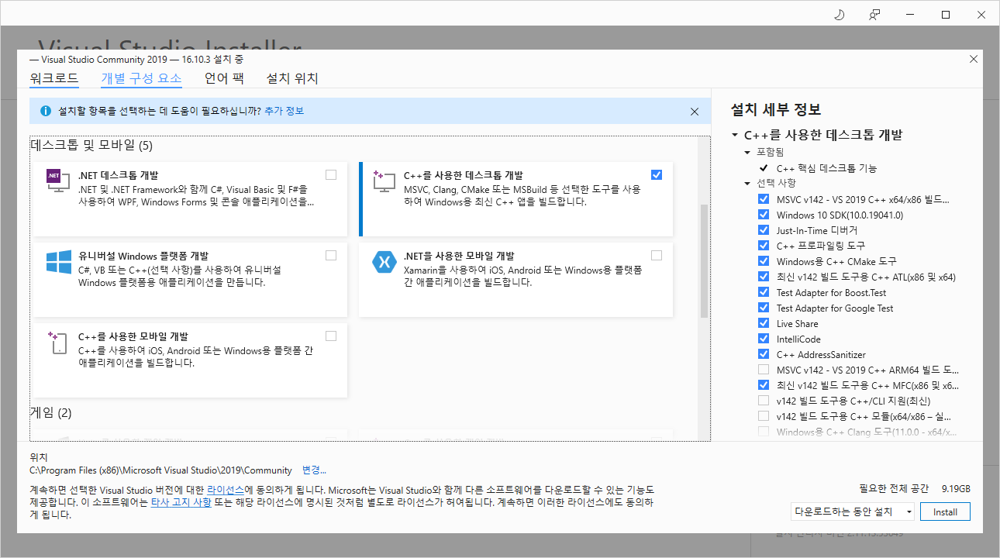
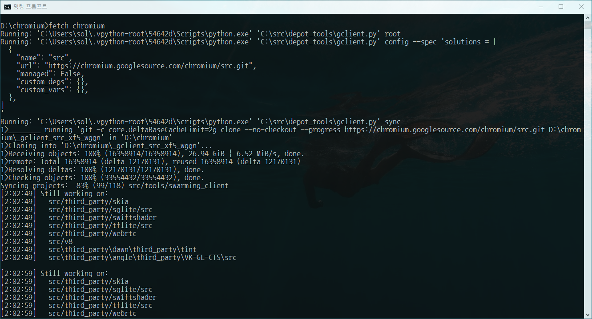
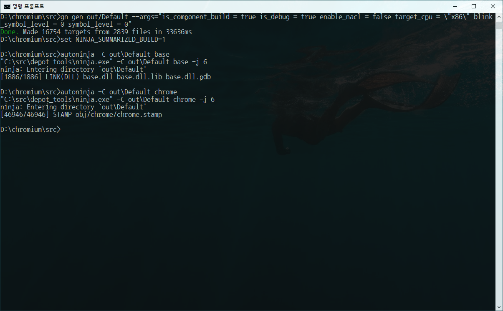

# Checking out and Building Chromium for Windows


[Checking out and Building Chromium for Windows (googlesource.com)](https://chromium.googlesource.com/chromium/src/+/refs/heads/main/docs/windows_build_instructions.md) 크로미움 프로젝트 윈도우 빌드 문서를 정리. 각주는 역자주.

  

## Contents

- [System requirements](https://chromium.googlesource.com/chromium/src/+/refs/heads/main/docs/windows_build_instructions.md#System-requirements) [#](##-System-requirements)
- [Setting up Windows](https://chromium.googlesource.com/chromium/src/+/refs/heads/main/docs/windows_build_instructions.md#Setting-up-Windows) [#](##-System-requirements)
- [Visual Studio](https://chromium.googlesource.com/chromium/src/+/refs/heads/main/docs/windows_build_instructions.md#Visual-Studio) [#](###-Visual-Studio)
- [Install](https://chromium.googlesource.com/chromium/src/+/refs/heads/main/docs/windows_build_instructions.md#Install) [#](##-Install-`depot_tools`)
- [Check python install](https://chromium.googlesource.com/chromium/src/+/refs/heads/main/docs/windows_build_instructions.md#Check-python-install) [#](##-Check-python-install)
- [Get the code](https://chromium.googlesource.com/chromium/src/+/refs/heads/main/docs/windows_build_instructions.md#Get-the-code) [#](##-Get-the-Code)
- [Setting up the build](https://chromium.googlesource.com/chromium/src/+/refs/heads/main/docs/windows_build_instructions.md#Setting-up-the-build) [#](##-Setting-up-the-build)
  - [Faster builds](https://chromium.googlesource.com/chromium/src/+/refs/heads/main/docs/windows_build_instructions.md#Faster-builds) [#](###-Faster-builds)
  - [Why is my build slow?](https://chromium.googlesource.com/chromium/src/+/refs/heads/main/docs/windows_build_instructions.md#Why-is-my-build-slow) [#](###-Why-is-my-build-slow?)
- [Build Chromium](https://chromium.googlesource.com/chromium/src/+/refs/heads/main/docs/windows_build_instructions.md#Build-Chromium) [#](##-Build-Chromium)
- [Run Chromium](https://chromium.googlesource.com/chromium/src/+/refs/heads/main/docs/windows_build_instructions.md#Run-Chromium) [#](##-Run-Chromium)
- [Running test targets](https://chromium.googlesource.com/chromium/src/+/refs/heads/main/docs/windows_build_instructions.md#Running-test-targets) [#](##-Running-test-targets)
- [Update your checkout](https://chromium.googlesource.com/chromium/src/+/refs/heads/main/docs/windows_build_instructions.md#Update-your-checkout) [#](##-Update-your-checkout)
  - [Editing and Debugging With the Visual Studio IDE](https://chromium.googlesource.com/chromium/src/+/refs/heads/main/docs/windows_build_instructions.md#Editing-and-Debugging-With-the-Visual-Studio-IDE) [#](###-Editing-and-Debugging-With-the-Visual-Studio-IDE)

- :triangular_flag_on_post: **MY RESULT** [#](#- :triangular_flag_on_post:- MY RESULT) /**CHECKOUT** [#](###-CHECKOUT) / **BUILD** [#](###-BUILD)

  

## System requirements

- 64-bit Intel CPU 그리고 최소 8GB 이상(16GB 이상 권장) RAM이 필요합니다.

- 100GB 이상 NTFS HDD가 요구됩니다. FAT32에서는 Git packfile이 4GB보다 커서 제대로 작동하지 않습니다.

  > **NTFS/FAT32** : CMD를 관리자권으로 실행하고 `chkdsk` 명령어로 파일시스템 종류를 확인할 수 있다. FAT32 파일시스템은 한 파일의 크기가 4GB-1Byte로 제한되어 오류가 발생한다.

  > **Git packfile** : 깃은 모든 파일, 파일 내용, 커밋 내용 모두를 오브젝트로 관리한다. 파일에 변경점이 생기면 전체 내용을 저장하는 새 오브젝트를 만들어 마치 새로 사진을 찍듯(`snapshot`) 저장한다. 깃은 공간낭비를 줄이기 위해 오브젝트의 공통부분을 압축한 `packfile`을 생성한다. `git gc` 명령어로 수동으로 할 수 있고, `git push` 등 깃이 필요하다고 판단할 때 수행한다. `git verify-pack`명령어로 내용을 확인할 수 있다.

- 알맞은 버전의 Visual Studio가 필요합니다. 다음 절에서 자세한 내용을 확인하세요.

- 윈도우 10 또는 그 이상

  > Mac, Linux에서도 가능하다. [Get the code](https://chromium.googlesource.com/chromium/src/+/refs/heads/main/docs/get_the_code.md) 문서를 참고.

  

## Setting up Windows

### Visual Studio

```
##요약
Visual Studio 2017/9를 설치(최소 15.7.2 , 16.0.0 이상 권장)
- C++를 사용한 데스크톱 개발 컴포넌트 설치
- MFC/ATL support 서브 컴포넌트 설치
- Windows 10 SDK, Debugging Tools 설치
```

Chromium을 빌드하려면 최소한 <u>Visual Studio 2017 (>=15.7.2)</u> 버전이 필요하고, 권장사항은 VS2019 (>=16.0.0) 이상입니다. Chromium을 디버깅하는 데도 Visual Studio를 사용하는데, VS2019에서는 긴 디버그 정보를 보다 잘 관리해줍니다(Chromium은 디버그 정보가 무척이나 깁니다.)  clang-cl 컴파일러를 쓰지만 Visual Studio 헤더파일, 라이브러리와 기타 도구도 사용할 수 있습니다. 라이센스 조건이 맞다면 Visual Studio Community 버전으로도 충분합니다. <u>"C++를 사용한 데스크톱 개발"</u> 컴포넌트와 <u>"MFC/ATL support"</u> 서브 컴포넌트를 꼭 설치해야 합니다. 명령줄에서 Visual Studio installer로 아래와 같이 입력하면 됩니다(ARM64는 후술)

```shell
$ PATH_TO_INSTALLER.EXE ^
--add Microsoft.VisualStudio.Workload.NativeDesktop ^
--add Microsoft.VisualStudio.Component.VC.ATLMFC ^
--includeRecommended
```

ARM64 Win32용으로 빌드하려면, 아래와 같이 매개인자가 몇 개 더 필요합니다.

```shell
$ PATH_TO_INSTALLER.EXE ^
--add Microsoft.VisualStudio.Workload.NativeDesktop ^
--add Microsoft.VisualStudio.Component.VC.ATLMFC ^
--add Microsoft.VisualStudio.Component.VC.Tools.ARM64 ^
--add Microsoft.VisualStudio.Component.VC.MFC.ARM64 ^
--includeRecommended
```

<u>Windows 10 SDK</u>는 10.0.19041 버전 이상으로 설치해야 합니다. Visual Studio Installer에서 선택하여 설치할 수 있습니다.

<u>SDK 디버깅 툴</u>도 설치해야 합니다. Visual Studio installer로 Windows 10 SDK를 설치했다면 다음 메뉴에서 설치할 수 있습니다 : 제어판 → 프로그램 → 프로그램 및 기능 → "Windows Software Development Kit" 선택 → 우측 클릭하여 "변경" 선택 → Remove/Repair/Change등 중에서 Change 선택 → "Debugging Tools For Windows" 선택 → Change. 
또는 SDK installer를 따로 다운받아서 디버깅 툴을 설치할 수도 있습니다. 

> **VS버전확인** : Visual Studio가 이미 설치되어 있다면, 상단메뉴 [Help] - [Microsoft Visual Studio Info]에서 버전정보를 확인. 

> **VS권장사양** : 2019버전의 경우 2GB RAM(8GB 이상 권장)과 최소 800MB 이상 20~50GB 저장공간이 필요하다.

> **VS라이센스** : Community 버전은 개인 개발자, 학교, OSI가 인정한 오픈소스 커뮤니티, 비영리단체는 제한없이 무료로 사용할 수 있다. 상업용 제품을 만들고자 할 때는 250대 PC/이용자 이하 또는 매출 10억 원 이하 기업만 최대 5개의 라이센스를 무료로 이용할 수 있다. 

> **GUI에서 컴포넌트 선택**
> 

  

## Install `depot_tools`

```
##요약
depot_tools를 설치
- 시스템 변수 PATH에 경로추가
- DEPOT_TOOLS_WIN_TOOLCHAIN 시스템 변수 추가
- CMD에서 vs2019_install 변수 추가
- CMD에서 gclient 호출 및 필요한 도구설치
```

[depot_tools bundle](https://storage.googleapis.com/chrome-infra/depot_tools.zip)을 다운받고 적절한 곳에 압축을 풉니다.

> **경고!** 압축파일을 해제할 때는 압축파일 창에서 드래그앤드롭하거나 복사붙여넣기로 하면 안된다. 숨은 ".git" 파일을 놓치게 되는데, 이건 depot_tool 자동화에 꼭 필요한 파일이다. 우측클릭후 전체 해제 기능을 사용하라.

이제 depot_tools를 PATH에 추가해야 합니다. `C:\src\depot_tools` 경로에 파일을 내려받았다고 가정하겠습니다. 다음 메뉴에 진입합니다.

제어판 → 시스템 및 보안 → 시스템 → 고급 시스템 설정 → 환경변수

관리자 권한이 있으면 시스템 변수 PATH에 `C:\src\depot_tools`를 추가해줍니다. 맨앞에, 또는 적어도 Python이나 Git이 저장된 디렉토리 경로보다는 앞에 추가합니다.

관리자 권한이 없다면, 사용자 변수 PATH에 경로를 추가할 수밖에 없습니다. 시스템에 파이썬이 설치되어 있다면 제대로 작동하지 않을 겁니다. 운이 없군요.

이제 콘솔창에서 `vs2017_install`이나 `vs2019_install` 변수에 VS 설치경로를 추가합시다. `set vs2019_install=C:\Program Files (x86)\Microsoft Visual Studio\2019\Community`와 같이 명령어를 입력합니다.

> 잘 설정됐는지 확인하려면 `set | find "vs"`를 입력해 환경변수를 확인해봅시다.

cmd.exe 쉘에서 gclient를 매개인자 없이 호출합니다. 처음 실행될 때, Windows-specific bits과 msysgit, python 중 필요한 것을 모두 설치할 것입니다. 

> [BITS는](https://docs.microsoft.com/ko-kr/windows/win32/bits/about-bits) 유휴 네트워크 대역폭을 사용해 백그라운드에서 파일을 다운로드하거나 HTTP 웹서버 또는 SMB 파일 서버에 파일을 업로드.

- gclient를 cygwin이나 PowerShell에서 실행하는 경우, 잘 작동하는 것처럼 보여도 msygit, python, 기타 필요한 도구가 제대로 설치되지 않을 수 있습니다.
- gcleint를 처음 실행할 때 파일 시스템 오류가 나오면  [disable Windows Indexing](http://tortoisesvn.tigris.org/faq.html#cantmove2) 문서를 참조하세요.


## Check python install

gclient를 실행한 다음에는 명령줄 프롬프트를 열고 `where python`을 실행하고 depot_tools `python.bat`이 가장 먼저 나오는지 확인합니다. 만약  제대로 되지 않는다면 [crbug.com/611087](https://crbug.com/611087) 문서를 참조하세요.

[App Execution Aliases](https://docs.microsoft.com/en-us/windows/apps/desktop/modernize/desktop-to-uwp-extensions#alias) 때문에 다른 python 설치파일과 충돌할 수 있습니다. 설정 → 앱 → 앱 실행 별칭 메뉴에 진입해서 python installer를 가리키고 있는 'python.exe'와 'python3.exe' 항목을 해제합니다.

> **app execution alias** : 명령줄에서 프로그램을 실행하기 위한 별칭(alias)를 정의

  

## Get the Code

먼저 Git 설정부터 합시다.

```shell
$ git config --global user.name "My Name"
$ git config --global user.email "my-name@chromium.org"
$ git config --global core.autocrlf false
$ git config --global core.filemode false
$ git config --global branch.autosetuprebase always
```

`chromium` 디렉토리를 생성하고 이동합니다 (디렉토리 이름은 경로에 공백만 없다면 마음대로 지어도 됩니다.)

```shell
$ mkdir chromium && cd chromium
```

`depot_tools`에서 `fetch`를 실행해서 코드와 의존성을 가져옵니다.

```shell
$ fetch chromium [--no-history]  # --no-hisotory 옵션 꼭 붙이자..
```

저장소 기록을 모두 가져올게 아니라면, `--no-history` 옵션으로 많은 시간을 절약할 수 있습니다.

빨라도 30분 정도 소요되며, 네트워크 속도가 느린 경우 몇 시간이 걸리기도 합니다.

> chromium 소스코드는 30GB 정도, 3시간 걸림

`fetch`가 완료되면, `.gclient` 숨겨진 파일을 만들고 작업중인 디렉토리에 `src` 디렉토리도 생성할 겁니다. 이제 `src` 디렉토리로 이동합시다.

```shell
$ cd src
```

*선택사항*: Google 서비스를 만들려면 [API keys](https://www.chromium.org/developers/how-tos/api-keys)도 설치해야겠습니다만, 대부분의 경우에는 필요하지 않습니다.

  

## Setting up the build

Chromium은 메인 빌드 툴로 [Ninja](https://ninja-build.org/)를 사용하며 [GN](https://gn.googlesource.com/gn/+/master/docs/quick_start.md) 툴로 `.ninja` 파일을 생성합니다. 빌드 디렉토리는 설정을 다르게 해서 마음대로 여러 개를 만들어도 됩니다. 빌드 디렉토리를 만들려면 : 

```shell
$ gn gen out/Default
```

>Visual Studio에서 코드를 편집하고 디버깅하려면 `--ide` 옵션을 추가해주세요.
>`gn gen --ide=vs out\Default`

- 새 빌드 디렉토리를 만들었을 때만 시랭하면 됩니다. Ninja에서 빌드파일을 업데이트합니다.
- `Default` 대신 다른 이름을 적어도 되지만, `out`의 서브 디렉토리여야 합니다.
- 배포 설정이나 Visual Studio 대체버전 등 다른 빌드 매개인자는 [GN build configuration](https://www.chromium.org/developers/gn-build-configuration)를 참고. 기본설정은 호스트 운영체제와 CPU에 대응하는 디버깅 컴포넌트 빌드입니다.
- GN에 대해 더 알고 싶다면, 명령줄에서 `gn help`를 실행하거나 [quick start guide](https://gn.googlesource.com/gn/+/master/docs/quick_start.md)를 보세요.


### Faster builds

- antivirus나 indexing 프로그램에서 빌드 디렉토리를 제외하고 파일 시스템 오버헤드를 줄여봅시다.
- 빌드 트리는 SSD 같이 빠른 디스크에 저장합시다.
- 코어는 많을수록 좋고(20+ 이상도 과하지 않습니다) RAM도 많이 필요합니다(64GB도 과하지 않습니다.)

빌드 속도를 높일만한 gn 플래그가 있습니다. 결과 디렉토리를 만들때나(`gn args out/Default`) gn gen 명령줄(`gn gen out/Default --args="is_component_build = true is_debug = true"`) 에서 효과가 있습니다. 다음과 같이 설정하면 도움이 될겁니다.

- `is_component_build = true` - 동적 링크 대신 증분 링크(Incremental Linking)로 빌드 속도를 높입니다.

  > **증분링크(Incremental Linking)**란, 처음 컴파일 할 때 함수 주소를 테이블에 보관해서 다음 컴파일시 수정된 것만 다시 링크를 계산해 좀더 빠르게 링크하도록 하는 기능이다. 초기 ilk파일을 토대로 빠르게 링크할 수 있다. 

  > **동적/정적링크**는 [[운영체제\]Static Linking vs Dynamic Linking(shared Library) 정적링킹 vs 동적링킹 (tistory.com)](https://jhnyang.tistory.com/42?category=815411) 블로그를 참조. **증분링크**은 [/INCREMENTAL(증분 링크) | Microsoft Docs](https://docs.microsoft.com/ko-kr/cpp/build/reference/incremental-link-incrementally?view=msvc-160) 문서 참조. 

- `enable_nacl = false` - 로컬 빌드에서는 불필요한 네이티브 클라이언트를 비활성화합니다.

- `target_cpu = "x86"` - x86 빌드가 x64 빌드보다 조금 더 빠르고 더 많은 target 파일에 증분 링크를 지원합니다. 다만, `enable_nacl = false` 옵션과 함께 사용하지 않으면 시간이 더 오래 걸릴 수 있습니다.

- `blink_symbol_level = 0` -  blink를 위한 소스코드 레벨의 디버깅을 하지 않고 빌드 타임을 줄입니다. blink를 디버깅하지 않을 때 적용하면 됩니다.

  > **Blink** 크로미움을 위한 렌더링 엔진이다.

링크 속도를 높이기 위해 `symbol_level = 1`이나 `symbol_level = 0`로 설정하고, 컴파일러와 링커가 해야할 일을 줄여볼 수 있습니다. `symbol_level = 1` 옵션은 컴파일러가 파일 이름과 라인넘버를 출력해줘서 소스코드 레벨의 디버깅을 할 수 있습니다. 다만, 지역 변수나 타입 정보는 보여주지 않습니다. `symbol_level = 0`에서는 소스코드 레벨 디버깅을 할 수 없고, 호출 스택에는 함수 이름이 표시됩니다. `symbol_level`을 바꾸려면 모든걸 다시 컴파일 해야 합니다.

> 결과 예시
>
> ```shell
> > gn gen out/Default --args="is_component_build = true is_debug = true enable_nacl = false target_cpu = \"x86\" blink_symbol_level = 0 symbol_level = 0"
> Done. Made 16754 targets from 2839 files in 33636ms
> ```

ninja를 호출할 때는 `chrome`으로 특정해서 모든 테스트 바이너리를 다 빌드하는 일이 없도록 합시다.

그래도 빌드하는 데는 오랜 시간이 걸릴겁니다. 수 시간 정도.

  

#### Use SCCACHE

빌드할 때 [sccache](https://github.com/mozilla/sccache)를 사용해서 다음과 같은 매개인자를 넘길 수도 있습니다.

- `cc_wrapper = "sccache"` -  `sccache` 바이너리가`%PATH%` 경로에 있을 때
- `chrome_pgo_phase = 0`

  

### Why is my build slow?

빌드를 느리게 하는 요소는 많은 것이 있지만, Windows Defender가 프로세스 시작을 늦추는 범인인 경우가 잦습니다. antivirus 스캐닝 범위에 Chromium src 디렉토리 전체를 제외했나요? 위에서 설명한 빌드 세팅을 적용해봤나요? 아니면 다른 링킹 설정으로 빌드 해봤나요? -j 옵션으로 한번에 수행할 프로세스 수를 지정해봤나요?  빌드 시간이 호스트 컴퓨터 스펙에서 기대되는 시간과 비교해서 어떤지 chromium-dev 메일링 리스트에서 확인해봤나요? 

그 다음에는 정보를 모아봅시다. `NINJA_SUMMARIZE_BUILD` 환경변수를 1로 설정하면 `autoninja`가 세 가지 일을 수행합니다. 첫째로, [NINJA_STATUS](https://ninja-build.org/manual.html#_environment_variables) 환경변수를 설정해서 ninja가 크롬을 빌드하는 동안 추가 정보를 출력합니다. 현재 빌드 프로세스가 몇 개나 실행중인지, 전체 진행단계 중 어디까지 완료됐는지, 매 초당 빌드 단계가 몇 개 완료됐는지, 빌드가 얼마동안 실행중인지 등을 보여줍니다.

```shell
$ set NINJA_SUMMARIZE_BUILD=1
$ autoninja -C out\Default base
ninja: Entering directory `out\Default'
[1 processes, 86/86 @ 2.7/s : 31.785s ] LINK(DLL) base.dll base.dll.lib base.dll.pdb
```

느린 프로세스가 나타나면 곧바로 알 수 있습니다. 그리고 빌드가 일반적인 경우와 비교해 느린지 어떤지 알 수 있습니다.

추가로, `NINJA_SUMMARIZE_BUILD=1` 설정을 하면, `autoninja`는 빌드가 완료되면 빌드 성능을 가장 느렸던 빌드 단계와 그 종류를 아래와 같이 요약해 출력합니다. 

```shell
$ set NINJA_SUMMARIZE_BUILD=1
$ autoninja -C out\Default base
Longest build steps:
       0.1 weighted s to build obj/base/base/trace_log.obj (6.7 s elapsed time)
       0.2 weighted s to build nasm.exe, nasm.exe.pdb (0.2 s elapsed time)
       0.3 weighted s to build obj/base/base/win_util.obj (12.4 s elapsed time)
       1.2 weighted s to build base.dll, base.dll.lib (1.2 s elapsed time)
Time by build-step type:
       0.0 s weighted time to generate 6 .lib files (0.3 s elapsed time sum)
       0.1 s weighted time to generate 25 .stamp files (1.2 s elapsed time sum)
       0.2 s weighted time to generate 20 .o files (2.8 s elapsed time sum)
       1.7 s weighted time to generate 4 PEFile (linking) files (2.0 s elapsed
time sum)
      23.9 s weighted time to generate 770 .obj files (974.8 s elapsed time sum)
26.1 s weighted time (982.9 s elapsed time sum, 37.7x parallelism)
839 build steps completed, average of 32.17/s
```

"weighted(가중치를 부여한)" 시간은 병행하여 실행한 task의 수로 빌드단계별 수행 시간을 나눈 값입니다. 느린 단계가 얼마나 "중요한" 단계였는지 대략적으로 보여줍니다. 완전하게 또는 대부분 직렬화된 링크는 경과시간과 거의 같거나 비슷하게 나옵니다. 999개 다른 컴파일과 병행해서 수행되는 컴파일의 경우 아주 작은 값으로 나옵니다.

빌드 후에 다음과 같은 스크립트를 실행해 레포트를 생성할 수 있습니다.

```shell
$ python depot_tools\post_build_ninja_summary.py -C out\Default
```

마지막으로, `NINJA_SUMMARIZE_BUILD=1` 설정을 하면 autoninja가 Ninja에 "-d stats"을 보내 오버헤드를 보고하도록 지시합니다. 도움이 됩니다. 만약, 예를 들어서, 프로세스 생성이 빌드를 느리게 만든다면, 제외 디렉토리에 clang-cl이 포함되지 않아서 백신 간섭이 있었기 때문일 겁니다.

```shell
$ set NINJA_SUMMARIZE_BUILD=1
$ autoninja -C out\Default base
"c:\src\depot_tools\ninja.exe" -C out\Default base -j 10 -d stats
metric                  count   avg (us)        total (ms)
.ninja parse            3555    1539.4          5472.6
canonicalize str        1383032 0.0             12.7
canonicalize path       1402349 0.0             11.2
lookup node             1398245 0.0             8.1
.ninja_log load         2       118.0           0.2
.ninja_deps load        2       67.5            0.1
node stat               2516    29.6            74.4
depfile load            2       1132.0          2.3
StartEdge               88      3508.1          308.7
FinishCommand           87      1670.9          145.4
CLParser::Parse         45      1889.1          85.0
```

[ninjatracing](https://github.com/nico/ninjatracing)으로 빌드 성능을 보기 좋게 정리한 보고서를 받아볼 수도 있습니다. `.ninja_log` 파일을 `.json` 형태로 바꿔서 [chrome://tracing](https://chromium.googlesource.com/chromium/src/+/refs/heads/main/docs/chrome%3A//tracing)에서 불러올 수 있게 해줍니다.

```shell
$ python ninjatracing out\Default\.ninja_log >build.json
```

  

## Build Chromium

이제 정말 Chromium을 빌드해봅시다.

```shell
$ autoninja -C out\Default chrome
```

`autoninja`는 `ninja`로 전달되는 매개인자를 자동으로 최적화해주는 래퍼입니다. 

`gn ls out/Default` 명령어로 GN에서 빌드 대상목록을 모두 확인할 수 있습니다. 그중 하나를 컴파일하려면, GN 라벨을 앞에 붙은 "\\\\" 없이 Ninja로 넘깁니다(그래야 `//chrome/test:unit_tests`가 `ninja -C out/Default chrome/test:unit_tests`를 사용할 수 있습니다).

  

## Run Chromium

빌드가 완료되면, 간단하게 다음과 같이 브라우저를 실행할 수 있습니다(`.exe` 부분은 생략 가능)

```shell
$ out\Default\chrome.exe
```

  

## Running test targets

테스트도 같은 방법으로 실행할 수 있습니다. `--gtest_filter` 옵션으로 어떤 테스트를 실행할지 한정할 수 있습니다.

```shell
$ out\Default\unit_tests.exe --gtest_filter="PushClientTest.*"
```

GoogleTest에 관해서는 해당 [GitHub page](https://github.com/google/googletest)를 참고하세요.

  

## Update your checkout

코드 체크아웃을 업데이트 하려면, 명령줄에 다음과 같이 입력합니다.

```shell
$ git rebase-update
$ gclient sync -D
```

첫번째 명령어는 주요 Chromium 저장소 코드를 업데이트하고 로컬 브랜치를 이른바 `origin/master`로 리베이스합니다. 이 명령어 대신 `git pull`이나 저장소를 업데이트할 다른 Git 명령어를 사용해도 됩니다.

두번째 명령어는 서브 저장소를 적절한 버전으로 동기화하고, 필요없어진 것들은 삭제하며, 필요한 hook을 다시 실행합니다.

  

### Editing and Debugging With the Visual Studio IDE

Visual Studio IDE로 코드를 수정하고 디버깅할 수 있습니다. Inteliisense는 있어도 되고 없어도 좋습니다.

> **IntelliSense** : 문장완성, 멤버목록, 매개변수 도움말(형식), 변수 요약정보(형식)을 제공하는 VS 추가기능

  

#### Using Visual Studio Intellisense

Chromium 개발때 Visual Studio Intellisense를 사용하려면 output 디렉토리를 생성할 때 `--ide` 옵션을 줘야합니다.

```shell
$ gn gen --ide=vs out\Default
$ devenv out\Default\all.sln
```

GN은 빌드 디렉토리에 `all.sln`[심볼릭 링크] 파일을 만듭니다. 이렇게 하면, IDE 기능은 그대로 활용하면서 Ninja가 컴파일하게 할 수 있습니다(Visual Studio로만 컴파일할 수 있는 모드는 없습니다.) "gen"을 다시 실행한 뒤에는 `--ide`옵션을 다시 설정해야 합니다. 그런데 보통은 빌드할 때 GN이 빌드와 IDE파일을 자동으로 업데이트합니다.

생성된 IDE 솔루션은 수 천 개의 프로젝트로 구성되어 로드하는 데 아주 오래 걸립니다. `--filters` 옵션으로 관심있는 코드만 프로젝트로 생성되도록 제한하세요. 이 옵션은 프로젝트 탐색기에 나타나는 파일은 제한하겠지만, 추가로 직접 파일을 열고 중단점을 추가로 설정해도 디버깅은 제대로 작동합니다. IDE에서 컴파일하고 실행하되 소스파일은 보이지 않게 하려면 다음 명령어를 입력하면 됩니다.

```shell
$ gn gen --ide=vs --filters=//chrome --no-deps out\Default
```

다음과 같이 관련있는 다른 디렉토리를 추가할 수도 있습니다 :
 `--filters=//chrome;//third_party/WebKit/*;//gpu/*`.

추가 옵션은 `gn help gen` 문서를 참고하세요.

  


#### Using Visual Studio without Intellisense

너무 많은 프로젝트 솔루션에 따른 성능저하를 피하면서 Visual Studio에서 Chrome을 개발하고 디버깅할 방법도 있습니다. IDE를 프로젝트 없이 열고, `File→Open→Projec/Solution` 메뉴에서 chrome.exe 바이너리를 열거나, Visual Studio 명령줄창에서 `devenv /debugexe out\Debug\chrome.exe <your arguments>`를 입력합니다. Visual Studio 코드 탐색 기능은 작동하지 않겠지만, [VsChromium Visual Studio Extension](https://chromium.github.io/vs-chromium/)를 설치하면 솔루션 탐색기도 사용할 수 있고 코드 검색 기능 같은 여러 유용한 기능도 사용할 수 있습니다. base_unittests.exe, browser_tests.exe 같이 관심있는 실행파일을 추가할 수 있으며, `Solution Explorer` 우측 클릭 후 `Set as Startup Project` 설정으로 특정 파일을 디버깅할 수도 있습니다. `Solution Explorer`을 우측 클릭해 `Properties` 옵션에서 명령줄 매개인자 같은 설정값도 바꿀 수 있습니다.

원래 기본적으로는 Visual Studio 디버거를 시작하면 브라우저 프로세스만 포함되는데, Chrome 전부를 디버깅하려면 [Microsoft's Child Process Debugging Power Tool](https://blogs.msdn.microsoft.com/devops/2014/11/24/introducing-the-child-process-debugging-power-tool/)를 설치해야 합니다. 이때는 Visual Studio를 관리자로 실행해야 합니다.  

  


## :triangular_flag_on_post: MY RESULT

### CHECKOUT



```shell
D:\chromium>fetch chromium
Running: 'C:\Users\sol\.vpython-root\54642d\Scripts\python.exe' 'C:\src\depot_tools\gclient.py' root
Running: 'C:\Users\sol\.vpython-root\54642d\Scripts\python.exe' 'C:\src\depot_tools\gclient.py' config --spec 'solutions = [
  {
    "name": "src",
    "url": "https://chromium.googlesource.com/chromium/src.git",
    "managed": False,
    "custom_deps": {},
    "custom_vars": {},
  },
]
'
Running: 'C:\Users\sol\.vpython-root\54642d\Scripts\python.exe' 'C:\src\depot_tools\gclient.py' sync
1>________ running 'git -c core.deltaBaseCacheLimit=2g clone --no-checkout --progress https://chromium.googlesource.com/chromium/src.git D:\chromium\_gclient_src_xf5_wgqn' in 'D:\chromium'
1>Cloning into 'D:\chromium\_gclient_src_xf5_wgqn'...
1>Receiving objects: 100% (16358914/16358914), 26.94 GiB | 6.52 MiB/s, done.
1>remote: Total 16358914 (delta 12170131), reused 16358914 (delta 12170131)
1>Resolving deltas: 100% (12170131/12170131), done.
1>Checking objects: 100% (33554432/33554432), done.
Syncing projects:  83% (99/118) src/tools/swarming_client
[2:02:49] Still working on:
[2:02:49]   src/third_party/skia
[2:02:49]   src/third_party/sqlite/src
[2:02:49]   src/third_party/swiftshader
[2:02:49]   src/third_party/tflite/src
[2:02:49]   src/third_party/webrtc
[2:02:49]   src/v8
[2:02:49]   src\third_party\dawn\third_party\tint
[2:02:49]   src\third_party\angle\third_party\VK-GL-CTS\src

[2:02:59] Still working on:
[2:02:59]   src/third_party/skia
[2:02:59]   src/third_party/sqlite/src
[2:02:59]   src/third_party/swiftshader
[2:02:59]   src/third_party/tflite/src
[2:02:59]   src/third_party/webrtc
[2:02:59]   src/v8
[2:02:59]   src\third_party\dawn\third_party\tint
[2:02:59]   src\third_party\angle\third_party\VK-GL-CTS\src

[2:03:09] Still working on:
[2:03:09]   src/third_party/skia
[2:03:09]   src/third_party/sqlite/src
[2:03:09]   src/third_party/swiftshader
[2:03:09]   src/third_party/tflite/src
[2:03:09]   src/third_party/webrtc
[2:03:09]   src/v8
[2:03:09]   src\third_party\dawn\third_party\tint
[2:03:09]   src\third_party\angle\third_party\VK-GL-CTS\src

[2:03:19] Still working on:
[2:03:19]   src/third_party/skia
[2:03:19]   src/third_party/sqlite/src
[2:03:19]   src/third_party/swiftshader
[2:03:19]   src/third_party/tflite/src
[2:03:19]   src/third_party/webrtc
[2:03:19]   src/v8
[2:03:19]   src\third_party\dawn\third_party\tint
[2:03:19]   src\third_party\angle\third_party\VK-GL-CTS\src

[2:03:24] Still working on:
[2:03:24]   src/third_party/skia
[2:03:24]   src/third_party/sqlite/src
[2:03:24]   src/third_party/swiftshader
[2:03:24]   src/third_party/tflite/src
[2:03:24]   src/third_party/webrtc
[2:03:24]   src/v8
[2:03:24]   src\third_party\dawn\third_party\tint
[2:03:24]   src\third_party\angle\third_party\VK-GL-CTS\src
Syncing projects:  86% (102/118) src\third_party\angle\third_party\rapidjson\src
[2:05:32] Still working on:
[2:05:32]   src/third_party/skia
[2:05:32]   src/third_party/sqlite/src
[2:05:32]   src/third_party/swiftshader
[2:05:32]   src/third_party/tflite/src
[2:05:32]   src/third_party/webrtc
[2:05:32]   src/v8
[2:05:32]   src\third_party\angle\third_party\VK-GL-CTS\src
[2:05:32]   src\third_party\openscreen\src\third_party\tinycbor\src
Syncing projects:  98% (116/118) src\third_party\vulkan-deps\vulkan-validation-layers\src
[2:10:19] Still working on:
[2:10:19]   src/v8
[2:10:19]   src\third_party\angle\third_party\VK-GL-CTS\src

[2:10:30] Still working on:
[2:10:30]   src/v8
[2:10:30]   src\third_party\angle\third_party\VK-GL-CTS\src

[2:10:40] Still working on:
[2:10:40]   src/v8
[2:10:40]   src\third_party\angle\third_party\VK-GL-CTS\src

[2:10:48] Still working on:
[2:10:48]   src/v8
[2:10:48]   src\third_party\angle\third_party\VK-GL-CTS\src
Syncing projects:  99% (117/118) src/v8
[2:11:48] Still working on:
[2:11:48]   src\third_party\angle\third_party\VK-GL-CTS\src

[2:11:58] Still working on:
[2:11:58]   src\third_party\angle\third_party\VK-GL-CTS\src

[2:12:08] Still working on:
[2:12:08]   src\third_party\angle\third_party\VK-GL-CTS\src

[2:12:18] Still working on:
[2:12:18]   src\third_party\angle\third_party\VK-GL-CTS\src

[2:12:28] Still working on:
[2:12:28]   src\third_party\angle\third_party\VK-GL-CTS\src

[2:12:38] Still working on:
[2:12:38]   src\third_party\angle\third_party\VK-GL-CTS\src

[2:12:48] Still working on:
[2:12:48]   src\third_party\angle\third_party\VK-GL-CTS\src

[2:12:58] Still working on:
[2:12:58]   src\third_party\angle\third_party\VK-GL-CTS\src

[2:13:08] Still working on:
[2:13:08]   src\third_party\angle\third_party\VK-GL-CTS\src

[2:13:18] Still working on:
[2:13:18]   src\third_party\angle\third_party\VK-GL-CTS\src

[2:13:28] Still working on:
[2:13:28]   src\third_party\angle\third_party\VK-GL-CTS\src

[2:13:38] Still working on:
[2:13:38]   src\third_party\angle\third_party\VK-GL-CTS\src

[2:13:48] Still working on:
[2:13:48]   src\third_party\angle\third_party\VK-GL-CTS\src

[2:13:58] Still working on:
[2:13:58]   src\third_party\angle\third_party\VK-GL-CTS\src

[2:14:08] Still working on:
[2:14:08]   src\third_party\angle\third_party\VK-GL-CTS\src

[2:14:18] Still working on:
[2:14:18]   src\third_party\angle\third_party\VK-GL-CTS\src

[2:14:28] Still working on:
[2:14:28]   src\third_party\angle\third_party\VK-GL-CTS\src

[2:14:38] Still working on:
[2:14:38]   src\third_party\angle\third_party\VK-GL-CTS\src

[2:14:48] Still working on:
[2:14:48]   src\third_party\angle\third_party\VK-GL-CTS\src

[2:14:58] Still working on:
[2:14:58]   src\third_party\angle\third_party\VK-GL-CTS\src

[2:15:08] Still working on:
[2:15:08]   src\third_party\angle\third_party\VK-GL-CTS\src

[2:15:09] Still working on:
[2:15:09]   src\third_party\angle\third_party\VK-GL-CTS\src
Syncing projects: 100% (118/118), done.
Hook 'vpython.bat -vpython-spec src/.vpython -vpython-tool install' took 75.44 secs
Hook 'vpython3 -vpython-spec src/.vpython3 -vpython-tool install' took 33.43 secs
Running hooks:   6% ( 7/110) nacltools
________ running 'python3 src/build/download_nacl_toolchains.py --mode nacl_core_sdk sync --extract' in 'D:\chromium'
INFO: --Syncing nacl_arm_glibc to revision 053185d68ed3b96640f15c4ae457b1ff373c6cac--
INFO: Downloading package archive: binutils_arm_i686_w64_mingw32.tgz (1/6)
INFO: Downloading package archive: gcc_arm_i686_w64_mingw32.tgz (2/6)
INFO: Downloading package archive: gcc_libs_arm.tgz (3/6)
INFO: Downloading package archive: gdb_i686_w64_mingw32.tgz (4/6)
INFO: Downloading package archive: glibc_arm.tgz (5/6)
INFO: Downloading package archive: sdk_libs_arm.tgz (6/6)
INFO: --Syncing nacl_x86_glibc to revision 73e5a44d837e54d335b4c618e1dd5d2028947a67--
INFO: Downloading package archive: core_sdk.tar.bz2 (1/3)
INFO: Downloading package archive: gdb_i686_w64_mingw32.tgz (2/3)
INFO: Downloading package archive: toolchain.tar.bz2 (3/3)
INFO: --Syncing nacl_x86_newlib to revision 11953a35fcd4f999b097a343bc49d89f94af21a8--
INFO: Downloading package archive: core_sdk.tgz (1/3)
INFO: Downloading package archive: gdb_i686_w64_mingw32.tgz (2/3)
INFO: Downloading package archive: naclsdk.tgz (3/3)
INFO: --Syncing pnacl_newlib to revision 8db20f20316f13d8886a2732099f5bb880568663--
INFO: Downloading package archive: binutils_i686_w64_mingw32.tgz (1/48)
INFO: Downloading package archive: binutils_x86_i686_w64_mingw32.tgz (2/48)
INFO: Downloading package archive: compiler_rt_bc_arm_bc.tgz (3/48)
INFO: Downloading package archive: compiler_rt_bc_i686_bc.tgz (4/48)
INFO: Downloading package archive: compiler_rt_bc_le32.tgz (5/48)
INFO: Downloading package archive: compiler_rt_bc_x86_64_bc.tgz (6/48)
INFO: Downloading package archive: core_sdk_libs_arm.tgz (7/48)
INFO: Downloading package archive: core_sdk_libs_i686.tgz (8/48)
INFO: Downloading package archive: core_sdk_libs_le32.tgz (9/48)
INFO: Downloading package archive: core_sdk_libs_mipsel.tgz (10/48)
INFO: Downloading package archive: core_sdk_libs_x86_64.tgz (11/48)
INFO: Downloading package archive: driver_i686_w64_mingw32.tgz (12/48)
INFO: Downloading package archive: libcxx_arm.tgz (13/48)
INFO: Downloading package archive: libcxx_arm_bc.tgz (14/48)
INFO: Downloading package archive: libcxx_i686.tgz (15/48)
INFO: Downloading package archive: libcxx_i686_bc.tgz (16/48)
INFO: Downloading package archive: libcxx_le32.tgz (17/48)
INFO: Downloading package archive: libcxx_mipsel.tgz (18/48)
INFO: Downloading package archive: libcxx_x86_64.tgz (19/48)
INFO: Downloading package archive: libcxx_x86_64_bc.tgz (20/48)
INFO: Downloading package archive: libgcc_eh_arm.tgz (21/48)
INFO: Downloading package archive: libgcc_eh_mips32.tgz (22/48)
INFO: Downloading package archive: libgcc_eh_x86_32.tgz (23/48)
INFO: Downloading package archive: libgcc_eh_x86_64.tgz (24/48)
INFO: Downloading package archive: libs_support_arm.tgz (25/48)
INFO: Downloading package archive: libs_support_arm_bc.tgz (26/48)
INFO: Downloading package archive: libs_support_i686.tgz (27/48)
INFO: Downloading package archive: libs_support_i686_bc.tgz (28/48)
INFO: Downloading package archive: libs_support_le32.tgz (29/48)
INFO: Downloading package archive: libs_support_mipsel.tgz (30/48)
INFO: Downloading package archive: libs_support_translator_arm.tgz (31/48)
INFO: Downloading package archive: libs_support_translator_arm_nonsfi.tgz (32/48)
INFO: Downloading package archive: libs_support_translator_mips32.tgz (33/48)
INFO: Downloading package archive: libs_support_translator_x86_32.tgz (34/48)
INFO: Downloading package archive: libs_support_translator_x86_32_nonsfi.tgz (35/48)
INFO: Downloading package archive: libs_support_translator_x86_64.tgz (36/48)
INFO: Downloading package archive: libs_support_x86_64.tgz (37/48)
INFO: Downloading package archive: libs_support_x86_64_bc.tgz (38/48)
INFO: Downloading package archive: llvm_i686_w64_mingw32.tgz (39/48)
INFO: Downloading package archive: metadata.tgz (40/48)
INFO: Downloading package archive: newlib_arm.tgz (41/48)
INFO: Downloading package archive: newlib_arm_bc.tgz (42/48)
INFO: Downloading package archive: newlib_i686.tgz (43/48)
INFO: Downloading package archive: newlib_i686_bc.tgz (44/48)
INFO: Downloading package archive: newlib_le32.tgz (45/48)
INFO: Downloading package archive: newlib_mipsel.tgz (46/48)
INFO: Downloading package archive: newlib_x86_64.tgz (47/48)
INFO: Downloading package archive: newlib_x86_64_bc.tgz (48/48)
INFO: --Syncing pnacl_translator to revision 8db20f20316f13d8886a2732099f5bb880568663--
INFO: Downloading package archive: sandboxed_translators.tgz (1/1)
INFO: Extracting package (nacl_arm_glibc) to directory: D:\chromium\src\native_client\toolchain\win_x86\nacl_arm_glibc
INFO: Extracting binutils_arm_i686_w64_mingw32.tgz (1/6)
|------------------------------------------------|
..................................................
INFO: Extracting gcc_arm_i686_w64_mingw32.tgz (2/6)
|------------------------------------------------|
..................................................
INFO: Extracting gcc_libs_arm.tgz (3/6)
|------------------------------------------------|
..................................................
INFO: Extracting gdb_i686_w64_mingw32.tgz (4/6)
|------------------------------------------------|
..................................................
INFO: Extracting glibc_arm.tgz (5/6)
|------------------------------------------------|
..................................................
INFO: Extracting sdk_libs_arm.tgz (6/6)
|------------------------------------------------|
..................................................
INFO: Extracting package (nacl_x86_glibc) to directory: D:\chromium\src\native_client\toolchain\win_x86\nacl_x86_glibc
INFO: Extracting core_sdk.tar.bz2 (1/3)
|------------------------------------------------|
..................................................
INFO: Extracting gdb_i686_w64_mingw32.tgz (2/3)
|------------------------------------------------|
..................................................
INFO: Extracting toolchain.tar.bz2 (3/3)
|------------------------------------------------|
..................................................
INFO: Extracting package (nacl_x86_newlib) to directory: D:\chromium\src\native_client\toolchain\win_x86\nacl_x86_newlib
INFO: Extracting core_sdk.tgz (1/3)
|------------------------------------------------|
...............................................
INFO: Extracting gdb_i686_w64_mingw32.tgz (2/3)
|------------------------------------------------|
..................................................
INFO: Extracting naclsdk.tgz (3/3)
|------------------------------------------------|
..................................................
INFO: Extracting package (pnacl_newlib) to directory: D:\chromium\src\native_client\toolchain\win_x86\pnacl_newlib
INFO: Extracting binutils_i686_w64_mingw32.tgz (1/48)
|------------------------------------------------|
..................................................
INFO: Extracting binutils_x86_i686_w64_mingw32.tgz (2/48)
|------------------------------------------------|
..................................................
INFO: Extracting compiler_rt_bc_arm_bc.tgz (3/48)
|------------------------------------------------|
.............................................
INFO: Extracting compiler_rt_bc_i686_bc.tgz (4/48)
|------------------------------------------------|
.............................................
INFO: Extracting compiler_rt_bc_le32.tgz (5/48)
|------------------------------------------------|
.............................................
INFO: Extracting compiler_rt_bc_x86_64_bc.tgz (6/48)
|------------------------------------------------|
.............................................
INFO: Extracting core_sdk_libs_arm.tgz (7/48)
|------------------------------------------------|
..................................................
INFO: Extracting core_sdk_libs_i686.tgz (8/48)
|------------------------------------------------|
..................................................
INFO: Extracting core_sdk_libs_le32.tgz (9/48)
|------------------------------------------------|
..................................................
INFO: Extracting core_sdk_libs_mipsel.tgz (10/48)
|------------------------------------------------|
..................................................
INFO: Extracting core_sdk_libs_x86_64.tgz (11/48)
|------------------------------------------------|
..................................................
INFO: Extracting driver_i686_w64_mingw32.tgz (12/48)
|------------------------------------------------|
..................................................
INFO: Extracting libcxx_arm.tgz (13/48)
|------------------------------------------------|
..................................................
INFO: Extracting libcxx_arm_bc.tgz (14/48)
|------------------------------------------------|
..................................................
INFO: Extracting libcxx_i686.tgz (15/48)
|------------------------------------------------|

INFO: Extracting libcxx_i686_bc.tgz (16/48)
|------------------------------------------------|
..................................................
INFO: Extracting libcxx_le32.tgz (17/48)
|------------------------------------------------|
..................................................
INFO: Extracting libcxx_mipsel.tgz (18/48)
|------------------------------------------------|
..................................................
INFO: Extracting libcxx_x86_64.tgz (19/48)
|------------------------------------------------|
..................................................
INFO: Extracting libcxx_x86_64_bc.tgz (20/48)
|------------------------------------------------|
..................................................
INFO: Extracting libgcc_eh_arm.tgz (21/48)
|------------------------------------------------|
.......
INFO: Extracting libgcc_eh_mips32.tgz (22/48)
|------------------------------------------------|
.......
INFO: Extracting libgcc_eh_x86_32.tgz (23/48)
|------------------------------------------------|
.........
INFO: Extracting libgcc_eh_x86_64.tgz (24/48)
|------------------------------------------------|
........
INFO: Extracting libs_support_arm.tgz (25/48)
|------------------------------------------------|
..................................................
INFO: Extracting libs_support_arm_bc.tgz (26/48)
|------------------------------------------------|
..................................................
INFO: Extracting libs_support_i686.tgz (27/48)
|------------------------------------------------|
..................................................
INFO: Extracting libs_support_i686_bc.tgz (28/48)
|------------------------------------------------|
..................................................
INFO: Extracting libs_support_le32.tgz (29/48)
|------------------------------------------------|
..................................................
INFO: Extracting libs_support_mipsel.tgz (30/48)
|------------------------------------------------|
..................................................
INFO: Extracting libs_support_translator_arm.tgz (31/48)
|------------------------------------------------|
..................................................
INFO: Extracting libs_support_translator_arm_nonsfi.tgz (32/48)
|------------------------------------------------|
..................................................
INFO: Extracting libs_support_translator_mips32.tgz (33/48)
|------------------------------------------------|
..................................................
INFO: Extracting libs_support_translator_x86_32.tgz (34/48)
|------------------------------------------------|
..................................................
INFO: Extracting libs_support_translator_x86_32_nonsfi.tgz (35/48)
|------------------------------------------------|
..................................................
INFO: Extracting libs_support_translator_x86_64.tgz (36/48)
|------------------------------------------------|
..................................................
INFO: Extracting libs_support_x86_64.tgz (37/48)
|------------------------------------------------|
..................................................
INFO: Extracting libs_support_x86_64_bc.tgz (38/48)
|------------------------------------------------|
..................................................
INFO: Extracting llvm_i686_w64_mingw32.tgz (39/48)
|------------------------------------------------|
.................................................
INFO: Extracting metadata.tgz (40/48)
|------------------------------------------------|
..................................................
INFO: Extracting newlib_arm.tgz (41/48)
|------------------------------------------------|
..................................................
INFO: Extracting newlib_arm_bc.tgz (42/48)
|------------------------------------------------|
..................................................
INFO: Extracting newlib_i686.tgz (43/48)
|------------------------------------------------|
..................................................
INFO: Extracting newlib_i686_bc.tgz (44/48)
|------------------------------------------------|
..................................................
INFO: Extracting newlib_le32.tgz (45/48)
|------------------------------------------------|
.................................................
INFO: Extracting newlib_mipsel.tgz (46/48)
|------------------------------------------------|
..................................................
INFO: Extracting newlib_x86_64.tgz (47/48)
|------------------------------------------------|
..................................................
INFO: Extracting newlib_x86_64_bc.tgz (48/48)
|------------------------------------------------|
..................................................
INFO: Extracting package (pnacl_translator) to directory: D:\chromium\src\native_client\toolchain\win_x86\pnacl_translator
INFO: Extracting sandboxed_translators.tgz (1/1)
|------------------------------------------------|
.................................................
Hook 'python3 src/build/download_nacl_toolchains.py --mode nacl_core_sdk sync --extract' took 122.93 secs
Running hooks:  16% (18/110) clang
________ running 'python3 src/tools/clang/scripts/update.py' in 'D:\chromium'
Downloading https://commondatastorage.googleapis.com/chromium-browser-clang/Win/clang-llvmorg-13-init-14732-g8a7b5ebf-2.tgz .......... Done.
Hook 'python3 src/tools/clang/scripts/update.py' took 11.98 secs
Running hooks:  23% (26/110) clang_format_win
________ running 'python3 src/third_party/depot_tools/download_from_google_storage.py --no_resume --no_auth --bucket chromium-clang-format -s src/buildtools/win/clang-format.exe.sha1' in 'D:\chromium'
0> Downloading src/buildtools/win/clang-format.exe@d4afd4eba27022f5f6d518133aebde57281677c9...
Downloading 1 files took 29.617901 second(s)
Hook 'python3 src/third_party/depot_tools/download_from_google_storage.py --no_resume --no_auth --bucket chromium-clang-format -s src/buildtools/win/clang-format.exe.sha1' took 30.07 secs
Running hooks:  26% (29/110) rc_win
________ running 'python3 src/third_party/depot_tools/download_from_google_storage.py --no_resume --no_auth --bucket chromium-browser-clang/rc -s src/build/toolchain/win/rc/win/rc.exe.sha1' in 'D:\chromium'
0> Downloading src/build/toolchain/win/rc/win/rc.exe@ba51d69039ffb88310b72b6568efa9f0de148f8f...
Downloading 1 files took 11.609782 second(s)
Hook 'python3 src/third_party/depot_tools/download_from_google_storage.py --no_resume --no_auth --bucket chromium-browser-clang/rc -s src/build/toolchain/win/rc/win/rc.exe.sha1' took 12.10 secs
Running hooks:  29% (32/110) test_fonts
________ running 'python3 src/third_party/depot_tools/download_from_google_storage.py --no_resume --extract --no_auth --bucket chromium-fonts -s src/third_party/test_fonts/test_fonts.tar.gz.sha1' in 'D:\chromium'
0> Downloading src/third_party/test_fonts/test_fonts.tar.gz@cd96fc55dc243f6c6f4cb63ad117cad6cd48dceb...
0> Extracting 33 entries from src/third_party/test_fonts/test_fonts.tar.gz to src/third_party/test_fonts/test_fonts
Downloading 1 files took 14.680602 second(s)
Hook 'python3 src/third_party/depot_tools/download_from_google_storage.py --no_resume --extract --no_auth --bucket chromium-fonts -s src/third_party/test_fonts/test_fonts.tar.gz.sha1' took 15.13 secs
Hook 'python3 src/third_party/depot_tools/download_from_google_storage.py --no_auth --quiet --bucket chromium-webrtc-resources -d src/third_party/opus/tests/resources' took 14.90 secs
Running hooks:  31% (35/110) apache_win32
________ running 'python3 src/third_party/depot_tools/download_from_google_storage.py --no_resume --directory --recursive --no_auth --num_threads=16 --bucket chromium-apache-win32 src/third_party/apache-win32' in 'D:\chromium'
12> Downloading src/third_party/apache-win32\bin\api-ms-win-core-namedpipe-l1-1-0.dll@cb59f1fe73c17446eb196fc0dd7d944a0cd9d81f...
11> Downloading src/third_party/apache-win32\bin\api-ms-win-core-handle-l1-1-0.dll@a2e2a40cea25ea4fd64b8deaf4fbe4a2db94107a...
0> Downloading src/third_party/apache-win32\bin\ApacheMonitor.exe@a09af35e49d42ecc0aa6ef43203a709f7732bdd5...
5> Downloading src/third_party/apache-win32\bin\api-ms-win-core-localization-l1-2-0.dll@9874398548891f6a08fc06437996f84eb7495783...
6> Downloading src/third_party/apache-win32\bin\api-ms-win-core-errorhandling-l1-1-0.dll@51cbb7ba47802dc630c2507750432c55f5979c27...
9> Downloading src/third_party/apache-win32\bin\api-ms-win-core-file-l1-2-0.dll@04669214375b25e2dc8a3635484e6eeb206bc4eb...
14> Downloading src/third_party/apache-win32\bin\api-ms-win-core-interlocked-l1-1-0.dll@f779cdef9ded19402aa72958085213d6671ca572...
8> Downloading src/third_party/apache-win32\bin\api-ms-win-core-memory-l1-1-0.dll@9c03356cf48112563bb845479f40bf27b293e95e...
7> Downloading src/third_party/apache-win32\bin\api-ms-win-core-file-l1-1-0.dll@9acbeef0ac510c179b319ca69cd5378d0e70504d...
15> Downloading src/third_party/apache-win32\bin\api-ms-win-core-processenvironment-l1-1-0.dll@2745259f4dbbefbf6b570ee36d224abdb18719bc...
10> Downloading src/third_party/apache-win32\bin\api-ms-win-core-file-l2-1-0.dll@402b7b8f8dcfd321b1d12fc85a1ee5137a5569b2...
4> Downloading src/third_party/apache-win32\bin\api-ms-win-core-debug-l1-1-0.dll@e7c8a6c29c3158f8b332eea5c33c3b1e044b5f73...
2> Downloading src/third_party/apache-win32\bin\api-ms-win-core-datetime-l1-1-0.dll@4940d5b92b6b80a40371f8df073bf3eb406f5658...
3> Downloading src/third_party/apache-win32\bin\api-ms-win-core-libraryloader-l1-1-0.dll@47143a66b4a2e2ba019bf1fd07bcca9cfb8bb117...
13> Downloading src/third_party/apache-win32\bin\api-ms-win-core-heap-l1-1-0.dll@b4310929ccb82dd3c3a779cab68f1f9f368076f2...
1> Downloading src/third_party/apache-win32\bin\api-ms-win-core-console-l1-1-0.dll@724f4f91041ad595e365b724a0348c83acf12bbb...
15> Downloading src/third_party/apache-win32\bin\api-ms-win-core-util-l1-1-0.dll@1e1a5ab47e4c2b3c32c81690b94954b7612bb493...
2> Downloading src/third_party/apache-win32\bin\api-ms-win-core-synch-l1-2-0.dll@a9aebbbb73b7b846b051325d7572f2398f5986ee...
4> Downloading src/third_party/apache-win32\bin\api-ms-win-core-rtlsupport-l1-1-0.dll@24f37d46dfc0ef303ef04abf9956241af55d25c9...
11> Downloading src/third_party/apache-win32\bin\api-ms-win-core-processthreads-l1-1-1.dll@0bffb9ed366853e7019452644d26e8e8f236241b...
6> Downloading src/third_party/apache-win32\bin\api-ms-win-core-processthreads-l1-1-0.dll@50699041060d14576ed7bacbd44be9af80eb902a...
7> Downloading src/third_party/apache-win32\bin\api-ms-win-core-sysinfo-l1-1-0.dll@f20ae25484a1c1b43748a1f0c422f48f092ad2c1...
12> Downloading src/third_party/apache-win32\bin\api-ms-win-core-string-l1-1-0.dll@637e4a9946691f76e6deb69bdc21c210921d6f07...
3> Downloading src/third_party/apache-win32\bin\api-ms-win-core-timezone-l1-1-0.dll@4bf13db65943e708690d6256d7ddd421cc1cc72b...
0> Downloading src/third_party/apache-win32\bin\api-ms-win-crt-conio-l1-1-0.dll@49002b58cb0df2ee8d868dec335133cf225657df...
9> Downloading src/third_party/apache-win32\bin\api-ms-win-core-synch-l1-1-0.dll@5584c189216a17228cca6cd07037aaa9a8603241...
13> Downloading src/third_party/apache-win32\bin\api-ms-win-crt-convert-l1-1-0.dll@c84e41fdcc4ca89a76ae683cb390a9b86500d3ca...
8> Downloading src/third_party/apache-win32\bin\api-ms-win-crt-environment-l1-1-0.dll@9a4818897251cacb7fe1c6fe1be3e854985186ad...
10> Downloading src/third_party/apache-win32\bin\api-ms-win-crt-filesystem-l1-1-0.dll@78fa03c89ea12ff93fa499c38673039cc2d55d40...
14> Downloading src/third_party/apache-win32\bin\api-ms-win-core-profile-l1-1-0.dll@e7e0b18a40a35bd8b0766ac72253de827432e148...
5> Downloading src/third_party/apache-win32\bin\api-ms-win-crt-locale-l1-1-0.dll@9c1df49a8dbdc8496ac6057f886f5c17b2c39e3e...
1> Downloading src/third_party/apache-win32\bin\api-ms-win-crt-heap-l1-1-0.dll@60b4cf246c5f414fc1cd12f506c41a1043d473ee...
4> Downloading src/third_party/apache-win32\bin\api-ms-win-crt-math-l1-1-0.dll@8b35ec4676bd96c2c4508dc5f98ca471b22deed7...
13> Downloading src/third_party/apache-win32\bin\api-ms-win-crt-stdio-l1-1-0.dll@982b5da1c1f5b9d74af6243885bcba605d54df8c...
3> Downloading src/third_party/apache-win32\bin\api-ms-win-crt-multibyte-l1-1-0.dll@91eef52c557aefd0fde27e8df4e3c3b7f99862f2...
11> Downloading src/third_party/apache-win32\bin\api-ms-win-crt-time-l1-1-0.dll@ee815a158baacb357d9e074c0755b6f6c286b625...
0> Downloading src/third_party/apache-win32\bin\api-ms-win-crt-process-l1-1-0.dll@ec96f7beeaec14d3b6c437b97b4a18a365534b9b...
15> Downloading src/third_party/apache-win32\bin\api-ms-win-crt-private-l1-1-0.dll@0c33cfe40edd278a692c2e73e941184fd24286d9...
7> Downloading src/third_party/apache-win32\bin\api-ms-win-crt-string-l1-1-0.dll@7f389e6f2d6e5beb2a3baf622a0c0ea24bc4de60...
2> Downloading src/third_party/apache-win32\bin\api-ms-win-crt-runtime-l1-1-0.dll@a19acefa3f95d1b565650fdbc40ef98c793358e9...
9> Downloading src/third_party/apache-win32\bin\httpd.exe@db1e5983c9b91253eb253bfd6c3f498bc0d86230...
12> Downloading src/third_party/apache-win32\bin\api-ms-win-crt-utility-l1-1-0.dll@eaa07829d012206ac55fb1af5cc6a35f341d22be...
10> Downloading src/third_party/apache-win32\bin\libapr-1.dll@d7083018a6f19148ffedc3d09416282bc69babd6...
8> Downloading src/third_party/apache-win32\bin\libapriconv-1.dll@18998f83f0115d6ebd67be781ec7b94e2fe67550...
14> Downloading src/third_party/apache-win32\bin\libaprutil-1.dll@ad35bc0f054af6a4e02f2e9a55c9213def6cb2cf...
6> Downloading src/third_party/apache-win32\bin\libcrypto-1_1-x64.dll@3b42f0b6560d1eff56e3a00756366bf260f1d608...
5> Downloading src/third_party/apache-win32\bin\libhttpd.dll@4ea4b5bfa0e3301fd326f9970efacfff028c5144...
13> Downloading src/third_party/apache-win32\bin\openssl.exe@2dba80e3402fb7bbeb5889eef2fd9815260bc4f8...
1> Downloading src/third_party/apache-win32\bin\libssl-1_1-x64.dll@a771c64188a388109c0f88a0b72593ca63b734fa...
3> Downloading src/third_party/apache-win32\bin\pcre.dll@35481488fbc34b113885466ab3e34b6615648045...
0> Downloading src/third_party/apache-win32\bin\php7ts.dll@82a55130eaa2138b7e1f8ddf609552ac2f679fc9...
11> Downloading src/third_party/apache-win32\bin\ucrtbase.dll@4189f4459c54e69c6d3155a82524bda7549a75a6...
15> Downloading src/third_party/apache-win32\bin\vcruntime140.dll@aaccc47a71fbcadf980932874056c9570a824890...
7> Downloading src/third_party/apache-win32\bin\zlib1.dll@bae633d523b5905725d50d59297d9c26997802f5...
2> Downloading src/third_party/apache-win32\modules\mod_access_compat.so@15cb4ef42fe094ab865859900be14421741b4e74...
12> Downloading src/third_party/apache-win32\modules\mod_alias.so@a1ce8466c07eda65049e96360af7d6052363fabe...
10> Downloading src/third_party/apache-win32\modules\mod_authn_core.so@cbc0f27732a85e19057d2eaa99c787348fae637c...
9> Downloading src/third_party/apache-win32\modules\mod_asis.so@c66f70fa6dd25400787ec7816a55743bbb2cae90...
8> Downloading src/third_party/apache-win32\modules\mod_authz_host.so@b6db200f1e4d8921f5ea13867902926b37de99a0...
5> Downloading src/third_party/apache-win32\modules\mod_cgi.so@9fe78b0bc590613933f10ed037216449a9854080...
6> Downloading src/third_party/apache-win32\modules\mod_autoindex.so@f4ff8a89d66963f79c0dc42ed4002080f7c5b49f...
4> Downloading src/third_party/apache-win32\modules\mod_authz_core.so@c549d87dbb75923d9df934bef591438fd629ffe1...
14> Downloading src/third_party/apache-win32\modules\mod_env.so@632c51d3ebb008eb072362eab76d0c435f385882...
1> Downloading src/third_party/apache-win32\modules\mod_log_config.so@a7ceec0a4432a1b353d7d27191064596eab01414...
13> Downloading src/third_party/apache-win32\modules\mod_headers.so@fb6530a211bfa3859dbcc3330febf2eed5a5d579...
3> Downloading src/third_party/apache-win32\modules\mod_mime.so@27a07dd6f2cc214a22bf6beedbcb4624aa594623...
0> Downloading src/third_party/apache-win32\modules\mod_rewrite.so@83c43f08fc010f43345843818666c82254d79cd2...
11> Downloading src/third_party/apache-win32\modules\mod_ssl.so@03e42dcbd0064b2e3be7952df01849a870464db3...
15> Downloading src/third_party/apache-win32\modules\php7apache2_4.dll@454aedd338235a5618c34401077e639dde69dbef...
Downloading 69 files took 181.505365 second(s)
Hook 'python3 src/third_party/depot_tools/download_from_google_storage.py --no_resume --directory --recursive --no_auth --num_threads=16 --bucket chromium-apache-win32 src/third_party/apache-win32' took 187.95 secs
Running hooks:  34% (38/110) wasm_fuzzer
________ running 'python3 src/third_party/depot_tools/download_from_google_storage.py --no_resume --no_auth -u --bucket v8-wasm-fuzzer -s src/v8/test/fuzzer/wasm_corpus.tar.gz.sha1' in 'D:\chromium'
0> Downloading src/v8/test/fuzzer/wasm_corpus.tar.gz@a1493bb387aed38462c49f4351dc47e79e4b784b...
0> Extracting 47197 entries from src/v8/test/fuzzer/wasm_corpus.tar.gz to src/v8/test/fuzzer/wasm_corpus
Downloading 1 files took 42.815407 second(s)
Hook 'python3 src/third_party/depot_tools/download_from_google_storage.py --no_resume --no_auth -u --bucket v8-wasm-fuzzer -s src/v8/test/fuzzer/wasm_corpus.tar.gz.sha1' took 43.28 secs
Running hooks:  38% (42/110) node_win
________ running 'python3 src/third_party/depot_tools/download_from_google_storage.py --no_resume --no_auth --bucket chromium-nodejs/14.15.4 -s src/third_party/node/win/node.exe.sha1' in 'D:\chromium'
0> Downloading src/third_party/node/win/node.exe@58bca4fea5196d856e41f928c02f6d6af2421865...
Downloading 1 files took 19.565296 second(s)
Hook 'python3 src/third_party/depot_tools/download_from_google_storage.py --no_resume --no_auth --bucket chromium-nodejs/14.15.4 -s src/third_party/node/win/node.exe.sha1' took 20.04 secs
Running hooks:  39% (43/110) webui_node_modules
________ running 'python3 src/third_party/depot_tools/download_from_google_storage.py --no_resume --extract --no_auth --bucket chromium-nodejs -s src/third_party/node/node_modules.tar.gz.sha1' in 'D:\chromium'
0> Downloading src/third_party/node/node_modules.tar.gz@9ccbf8ef285a2b2b466c5c5300cec8fabbe2a3ba...
0> Extracting 11783 entries from src/third_party/node/node_modules.tar.gz to src/third_party/node/node_modules
Downloading 1 files took 21.239621 second(s)
Hook 'python3 src/third_party/depot_tools/download_from_google_storage.py --no_resume --extract --no_auth --bucket chromium-nodejs -s src/third_party/node/node_modules.tar.gz.sha1' took 21.69 secs
Running hooks:  46% (51/110) tools_traffic_annotation_windows
________ running 'python3 src/third_party/depot_tools/download_from_google_storage.py --no_resume --no_auth --num_threads=4 --bucket chromium-tools-traffic_annotation -d src/tools/traffic_annotation/bin/win32' in 'D:\chromium'
3> Downloading src/tools/traffic_annotation/bin/win32\traffic_annotation_auditor.exe@fe7bb9064cce90227aa3ab81469d714406eaff21...Downloading 1 files took 12.588497 second(s)
Hook 'python3 src/third_party/depot_tools/download_from_google_storage.py --no_resume --no_auth --num_threads=4 --bucket chromium-tools-traffic_annotation -d src/tools/traffic_annotation/bin/win32' took 13.08 secs
Running hooks:  47% (52/110) zucchini_testdata
________ running 'python3 src/third_party/depot_tools/download_from_google_storage.py --no_resume --no_auth --num_threads=4 --bucket chromium-binary-patching/zucchini_testdata --recursive -d src/components/zucchini' in 'D:\chromium'
0> Downloading src/components/zucchini\fuzzers\testdata\old_eventlog_provider.dll@c80fdce994ba043956e192f650d894555460ff9b...
2> Downloading src/components/zucchini\testdata\chrome64_1.exe@4970ef6f342f6a0da9ae7a4ed462f93ef68f142c...
1> Downloading src/components/zucchini\fuzzers\testdata\new_eventlog_provider.dll@89ce67035d2d2dae33cb2d98d4762e955b93df95...
3> Downloading src/components/zucchini\testdata\chrome64_2.exe@c3a974589d50956a3c8c17572fee078b9276ad9b...
0> Downloading src/components/zucchini\testdata\setup2.exe@12194273e8d509b6e81e4a6b63621081e1426028...
1> Downloading src/components/zucchini\testdata\setup1.exe@5d0e8fed8e9e091e184adb2e2e0e668def9cd2c5...
Downloading 6 files took 25.484593 second(s)
Hook 'python3 src/third_party/depot_tools/download_from_google_storage.py --no_resume --no_auth --num_threads=4 --bucket chromium-binary-patching/zucchini_testdata --recursive -d src/components/zucchini' took 31.51 secs
Running hooks:  54% (60/110) mediapipe_integration_testdata
________ running 'python3 src/content/test/gpu/gpu_tests/mediapipe_update.py' in 'D:\chromium'
0> Downloading D:\chromium\src\content\test\data\gpu\mediapipe_zip\mediapipe_chromium_tests.zip@1d6ca505c384ef8f5af14e7958f62d54ec126356...
Downloading 1 files took 19.924000 second(s)
Hook 'python3 src/content/test/gpu/gpu_tests/mediapipe_update.py' took 21.41 secs
Running hooks:  57% (63/110) subresource-filter-ruleset
________ running 'python3 src/third_party/depot_tools/download_from_google_storage.py --no_resume --no_auth --bucket chromium-ads-detection -s src/third_party/subresource-filter-ruleset/data/UnindexedRules.sha1' in 'D:\chromium'
0> Downloading src/third_party/subresource-filter-ruleset/data/UnindexedRules@d8fcb95cf0b94e3de99f92042175b682b99b7748...
Downloading 1 files took 110.445830 second(s)
Hook 'python3 src/third_party/depot_tools/download_from_google_storage.py --no_resume --no_auth --bucket chromium-ads-detection -s src/third_party/subresource-filter-ruleset/data/UnindexedRules.sha1' took 110.88 secs
Hook 'python3 src/testing/generate_location_tags.py --out src/testing/location_tags.json' took 67.99 secs
Running hooks: 100% (110/110), done.
Running: git submodule foreach 'git config -f $toplevel/.git/config submodule.$name.ignore all'
Running: git config --add remote.origin.fetch '+refs/tags/*:refs/tags/*'
Running: git config diff.ignoreSubmodules all
```

### BUILD


