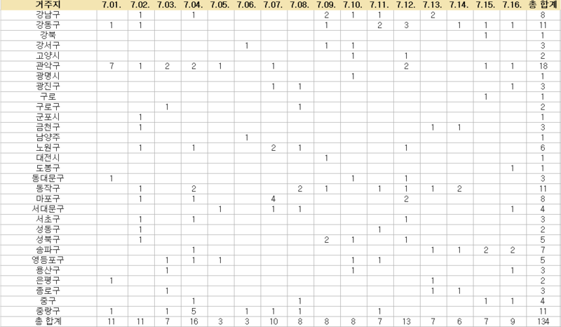
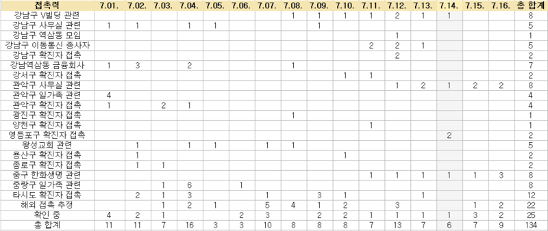

# 코로나 확진자 발생현황 톺아보기

서울시는 홈페이지에 아래와 같이 확진환자 발생동향을 공개하고 있다.

[환자 고유번호(지역/전국), 확진일자, 거주지, 여행력, 접촉력, 조치사항(입/퇴원/이관)]

내가 방문하려는 지역이 안전한지를 알고 싶은데 이 자료를 어떻게 봐야할까?

- 지역구

- 접촉력

위 두가지로 확진일자 기준 표를 작성했다(엑셀에서 피벗테이블 썼다) * 7/1~16기준

​
## 지역구별 발생동향

먼저, 지역구별 확진환자 발생동향이다. 최근에는 지역구별 엇비슷하다는 점을 알 수 있다.

그러나 지역구별 확진환자 현황은 환자 거주지 기준으로 작성된다. 

이를테면 강남구에서 감염된 10명이 중구에 살면 중구에 10명이 추가되는 것이라 큰 의미가 없다.

확진자가 거주지-감염지 이동했을테니 참고해볼만 하지만, 역학조사 없이는 유의미한 정보가 아니다.

그래서 접촉력을 기준으로, 일자별 확진환자 수를 확인했다.

## 접촉력기준 발생동향

[관악구 사무실 관련] 및 [중구 한화생명 관련] 집단감염이 지속 발생하고 있다는 점을 알 수 있었다.

그러나 이것만으로는 해당지역을 방문해도 좋은지 판단할 수는 없다.

역학조사가 끝났는지, 접촉자의 격리와 검사현황을 종합적으로 검토해야하기 때문이다.

결론, 정부의 발표에 귀기울이고 적극 협조하자.

